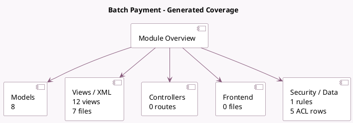

<!-- GENERATED:MODULE -->
---
tags: [odoo, enterprise, module]
---

# Batch Payment

- Scope: Enterprise Addons
- Source: enterprise/account_batch_payment
- Dependencies: [[docs/Community Addons/account/account|account]]

## Generated coverage

- Models: 8
- XML files with UI/data artifacts: 7
- Views: 12
- Actions: 4
- Menus: 2
- Rules (ir.rule): 1
- Access CSV entries: 5
- Controller units: 0
- Frontend asset files: 0

## Module map

## Detail notes

- Models: [[docs/Enterprise Addons/account_batch_payment/Models|Models]] (8)
- Views and XML: [[docs/Enterprise Addons/account_batch_payment/Views|Views]] (7 files)

## Key models

- `account.batch.error.wizard`
- `account.batch.error.wizard.line`
- `account.batch.payment`
- `account.create.batch.error.wizard`
- `account.journal`
- `account.payment`
- `account.payment.method`
- `report.account_batch_payment.print_batch_payment`

## Navigation

- [[../Enterprise Addons/Enterprise Addons|Back to scope]]
- [[../../docs/docs|Back to docs]]

<!-- GENERATED:MODULE -->

