<!-- GENERATED:MODEL -->
---
tags: [odoo, enterprise, generated, model]
---

# budget.analytic

- Module: [[docs/Enterprise Addons/account_budget/account_budget|account_budget]]
- Scope: Enterprise Addons
- Defined in module: yes
- Source files: `models/budget_analytic.py`
- Python classes: `BudgetAnalytic`
- Description: Budget
- Inherits: `mail.activity.mixin`, `mail.thread`

## Field footprint

- Detected fields: 10
- Field types: `Char` x 1, `Date` x 2, `Many2one` x 3, `One2many` x 2, `Selection` x 2
- Relation fields: 5

## Sample fields

- `budget_line_ids`: `One2many` (comodel `budget.line`)
- `budget_type`: `Selection`
- `children_ids`: `One2many` (comodel `budget.analytic`)
- `company_id`: `Many2one` (comodel `res.company`)
- `date_from`: `Date` (comodel `Start Date`)
- `date_to`: `Date` (comodel `End Date`)
- `name`: `Char` (comodel `Budget Name`)
- `parent_id`: `Many2one` (comodel `budget.analytic`)
- `state`: `Selection`
- `user_id`: `Many2one` (comodel `res.users`)

## Method hints

- Detected methods: 12
- Action methods: `action_budget_cancel`, `action_budget_confirm`, `action_budget_done`, `action_budget_draft`, `action_open_budget_lines`, `action_open_budget_report`
- Compute methods: none
- Onchange methods: none

## Direct relation diagram

```plantuml
@startuml
!define ODOO_COLOR_PRIMARY #714B67
!define ODOO_COLOR_ACCENT #875A7B
!define ODOO_COLOR_BG #FAF7FA

skinparam backgroundColor ODOO_COLOR_BG
skinparam defaultTextAlignment left
skinparam ArrowColor ODOO_COLOR_ACCENT
skinparam ClassBackgroundColor white
skinparam ClassBorderColor ODOO_COLOR_PRIMARY
skinparam ComponentBackgroundColor white
skinparam ComponentBorderColor ODOO_COLOR_PRIMARY
skinparam NoteBackgroundColor #FFF8FF
skinparam NoteBorderColor ODOO_COLOR_ACCENT
skinparam SequenceLifeLineBorderColor ODOO_COLOR_ACCENT
skinparam SequenceLifeLineBackgroundColor #FFFFFF
skinparam SequenceParticipantBorderColor ODOO_COLOR_PRIMARY
skinparam SequenceParticipantBackgroundColor #FFFFFF
skinparam sequence {
  ArrowColor ODOO_COLOR_ACCENT
  ActorBorderColor ODOO_COLOR_PRIMARY
}
title budget.analytic - Direct Relations
class "budget.analytic" as budget_analytic
class "budget.analytic" as budget_analytic
class "budget.line" as budget_line
class "res.company" as res_company
class "res.users" as res_users
budget_analytic --> budget_analytic : parent_id
budget_analytic --|> budget_analytic : children_ids
budget_analytic --> res_users : user_id
budget_analytic --|> budget_line : budget_line_ids
budget_analytic --> res_company : company_id
@enduml
```

## Navigation

- **Parent:** [[docs/Enterprise Addons/account_budget/Models]]

<!-- GENERATED:MODEL -->
