<!-- GENERATED:MODEL -->
---
tags: [odoo, enterprise, generated, model]
---

# budget.line

- Module: [[docs/Enterprise Addons/account_budget/account_budget|account_budget]]
- Scope: Enterprise Addons
- Defined in module: yes
- Source files: `models/budget_line.py`
- Python classes: `BudgetLine`
- Description: Budget Line
- Inherits: `analytic.plan.fields.mixin`

## Field footprint

- Detected fields: 14
- Field types: `Boolean` x 1, `Char` x 1, `Date` x 2, `Float` x 2, `Integer` x 1, `Many2one` x 3, `Monetary` x 3, `Selection` x 1
- Relation fields: 3

## Sample fields

- `achieved_amount`: `Monetary` (compute `_compute_all`)
- `achieved_percentage`: `Float` (compute `_compute_all`)
- `budget_amount`: `Monetary`
- `budget_analytic_id`: `Many2one` (comodel `budget.analytic`)
- `budget_analytic_state`: `Selection` (related `budget_analytic_id.state`, store `True`)
- `company_id`: `Many2one` (comodel `res.company`, related `budget_analytic_id.company_id`, store `True`)
- `currency_id`: `Many2one` (comodel `res.currency`, compute `_compute_currency_id`)
- `date_from`: `Date` (comodel `Start Date`, related `budget_analytic_id.date_from`, store `True`)
- `date_to`: `Date` (comodel `End Date`, related `budget_analytic_id.date_to`, store `True`)
- `is_above_budget`: `Boolean` (compute `_compute_above_budget`)
- `name`: `Char` (related `budget_analytic_id.name`)
- `sequence`: `Integer` (comodel `Sequence`)
- `theoritical_amount`: `Monetary` (compute `_compute_theoritical_amount`)
- `theoritical_percentage`: `Float` (compute `_compute_theoritical_amount`)

## Method hints

- Detected methods: 9
- Action methods: `action_open_budget_entries`
- Compute methods: `_compute_above_budget`, `_compute_all`, `_compute_currency_id`, `_compute_theoritical_amount`
- Onchange methods: none

## Direct relation diagram

```plantuml
@startuml
!define ODOO_COLOR_PRIMARY #714B67
!define ODOO_COLOR_ACCENT #875A7B
!define ODOO_COLOR_BG #FAF7FA

skinparam backgroundColor ODOO_COLOR_BG
skinparam defaultTextAlignment left
skinparam ArrowColor ODOO_COLOR_ACCENT
skinparam ClassBackgroundColor white
skinparam ClassBorderColor ODOO_COLOR_PRIMARY
skinparam ComponentBackgroundColor white
skinparam ComponentBorderColor ODOO_COLOR_PRIMARY
skinparam NoteBackgroundColor #FFF8FF
skinparam NoteBorderColor ODOO_COLOR_ACCENT
skinparam SequenceLifeLineBorderColor ODOO_COLOR_ACCENT
skinparam SequenceLifeLineBackgroundColor #FFFFFF
skinparam SequenceParticipantBorderColor ODOO_COLOR_PRIMARY
skinparam SequenceParticipantBackgroundColor #FFFFFF
skinparam sequence {
  ArrowColor ODOO_COLOR_ACCENT
  ActorBorderColor ODOO_COLOR_PRIMARY
}
title budget.line - Direct Relations
class "budget.line" as budget_line
class "budget.analytic" as budget_analytic
class "res.company" as res_company
class "res.currency" as res_currency
budget_line --> budget_analytic : budget_analytic_id
budget_line --> res_currency : currency_id
budget_line --> res_company : company_id
@enduml
```

## Navigation

- **Parent:** [[docs/Enterprise Addons/account_budget/Models]]

<!-- GENERATED:MODEL -->
