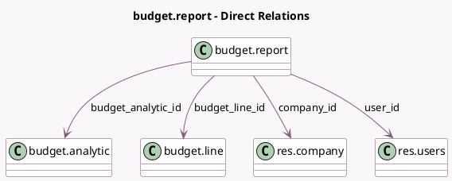

<!-- GENERATED:MODEL -->
---
tags: [odoo, enterprise, generated, model]
---

# budget.report

- Module: [[docs/Enterprise Addons/account_budget/account_budget|account_budget]]
- Scope: Enterprise Addons
- Defined in module: yes
- Source files: `reports/budget_report.py`
- Python classes: `BudgetReport`
- Description: Budget Report
- Inherits: `analytic.plan.fields.mixin`

## Field footprint

- Detected fields: 12
- Field types: `Char` x 2, `Date` x 1, `Float` x 3, `Many2one` x 4, `Many2oneReference` x 1, `Selection` x 1
- Relation fields: 4

## Sample fields

- `achieved`: `Float` (comodel `Achieved`)
- `budget`: `Float` (comodel `Budget`)
- `budget_analytic_id`: `Many2one` (comodel `budget.analytic`)
- `budget_line_id`: `Many2one` (comodel `budget.line`)
- `company_id`: `Many2one` (comodel `res.company`)
- `date`: `Date` (comodel `Date`)
- `description`: `Char` (comodel `Description`)
- `line_type`: `Selection`
- `res_id`: `Many2oneReference` (comodel `Document`)
- `res_model`: `Char` (comodel `Model`)
- `theoretical`: `Float`
- `user_id`: `Many2one` (comodel `res.users`)

## Method hints

- Detected methods: 4
- Action methods: `action_open_reference`
- Compute methods: none
- Onchange methods: none

## Direct relation diagram

## Navigation

- **Parent:** [[docs/Enterprise Addons/account_budget/Models]]

<!-- GENERATED:MODEL -->
