<!-- GENERATED:MODEL -->
---
tags: [odoo, enterprise, generated, model]
---

# budget.split.wizard

- Module: [[docs/Enterprise Addons/account_budget/account_budget|account_budget]]
- Scope: Enterprise Addons
- Defined in module: yes
- Source files: `wizards/budget_split_wizard.py`
- Python classes: `BudgetSplitWizard`
- Description: Budget Split Wizard

## Field footprint

- Detected fields: 4
- Field types: `Date` x 2, `Many2many` x 1, `Selection` x 1
- Relation fields: 1

## Sample fields

- `analytical_plan_ids`: `Many2many` (comodel `account.analytic.plan`)
- `date_from`: `Date`
- `date_to`: `Date`
- `period`: `Selection`

## Method hints

- Detected methods: 2
- Action methods: `action_budget_split`
- Compute methods: none
- Onchange methods: none

## Direct relation diagram

```plantuml
@startuml
!define ODOO_COLOR_PRIMARY #714B67
!define ODOO_COLOR_ACCENT #875A7B
!define ODOO_COLOR_BG #FAF7FA

skinparam backgroundColor ODOO_COLOR_BG
skinparam defaultTextAlignment left
skinparam ArrowColor ODOO_COLOR_ACCENT
skinparam ClassBackgroundColor white
skinparam ClassBorderColor ODOO_COLOR_PRIMARY
skinparam ComponentBackgroundColor white
skinparam ComponentBorderColor ODOO_COLOR_PRIMARY
skinparam NoteBackgroundColor #FFF8FF
skinparam NoteBorderColor ODOO_COLOR_ACCENT
skinparam SequenceLifeLineBorderColor ODOO_COLOR_ACCENT
skinparam SequenceLifeLineBackgroundColor #FFFFFF
skinparam SequenceParticipantBorderColor ODOO_COLOR_PRIMARY
skinparam SequenceParticipantBackgroundColor #FFFFFF
skinparam sequence {
  ArrowColor ODOO_COLOR_ACCENT
  ActorBorderColor ODOO_COLOR_PRIMARY
}
title budget.split.wizard - Direct Relations
class "budget.split.wizard" as budget_split_wizard
class "account.analytic.plan" as account_analytic_plan
budget_split_wizard .. account_analytic_plan : analytical_plan_ids
@enduml
```

## Navigation

- **Parent:** [[docs/Enterprise Addons/account_budget/Models]]

<!-- GENERATED:MODEL -->
