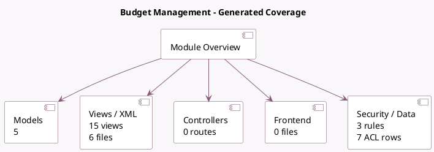

<!-- GENERATED:MODULE -->
---
tags: [odoo, enterprise, module]
---

# Budget Management

- Scope: Enterprise Addons
- Source: enterprise/account_budget
- Dependencies: [[docs/Enterprise Addons/accountant/accountant|accountant]]

## Generated coverage

- Models: 5
- XML files with UI/data artifacts: 6
- Views: 15
- Actions: 4
- Menus: 2
- Rules (ir.rule): 3
- Access CSV entries: 7
- Controller units: 0
- Frontend asset files: 0

## Module map

## Detail notes

- Models: [[docs/Enterprise Addons/account_budget/Models|Models]] (5)
- Views and XML: [[docs/Enterprise Addons/account_budget/Views|Views]] (6 files)

## Key models

- `account.analytic.account`
- `budget.analytic`
- `budget.line`
- `budget.report`
- `budget.split.wizard`

## Navigation

- [[../Enterprise Addons/Enterprise Addons|Back to scope]]
- [[../../docs/docs|Back to docs]]

<!-- GENERATED:MODULE -->

