<!-- GENERATED:MODEL -->
---
tags: [odoo, enterprise, generated, model]
---

# account.account

- Module: [[docs/Enterprise Addons/account_fiscal_categories/account_fiscal_categories|account_fiscal_categories]]
- Scope: Enterprise Addons
- Defined in module: extension only
- Source files: `models/account_account.py`
- Python classes: `AccountAccount`

## Field footprint

- Detected fields: 3
- Field types: `Float` x 1, `Many2one` x 1, `One2many` x 1
- Relation fields: 2

## Sample fields

- `current_rate`: `Float` (compute `_compute_current_rate`)
- `fiscal_category_id`: `Many2one` (comodel `account.fiscal.category`)
- `rate_ids`: `One2many` (comodel `account.account.fiscal.rate`)

## Method hints

- Detected methods: 2
- Action methods: none
- Compute methods: `_compute_current_rate`
- Onchange methods: `_onchange_internal_group`

## Direct relation diagram

```plantuml
@startuml
!define ODOO_COLOR_PRIMARY #714B67
!define ODOO_COLOR_ACCENT #875A7B
!define ODOO_COLOR_BG #FAF7FA

skinparam backgroundColor ODOO_COLOR_BG
skinparam defaultTextAlignment left
skinparam ArrowColor ODOO_COLOR_ACCENT
skinparam ClassBackgroundColor white
skinparam ClassBorderColor ODOO_COLOR_PRIMARY
skinparam ComponentBackgroundColor white
skinparam ComponentBorderColor ODOO_COLOR_PRIMARY
skinparam NoteBackgroundColor #FFF8FF
skinparam NoteBorderColor ODOO_COLOR_ACCENT
skinparam SequenceLifeLineBorderColor ODOO_COLOR_ACCENT
skinparam SequenceLifeLineBackgroundColor #FFFFFF
skinparam SequenceParticipantBorderColor ODOO_COLOR_PRIMARY
skinparam SequenceParticipantBackgroundColor #FFFFFF
skinparam sequence {
  ArrowColor ODOO_COLOR_ACCENT
  ActorBorderColor ODOO_COLOR_PRIMARY
}
title account.account - Direct Relations
class "account.account" as account_account
class "account.account.fiscal.rate" as account_account_fiscal_rate
class "account.fiscal.category" as account_fiscal_category
account_account --> account_fiscal_category : fiscal_category_id
account_account --|> account_account_fiscal_rate : rate_ids
@enduml
```

## Navigation

- **Parent:** [[docs/Enterprise Addons/account_fiscal_categories/Models]]

<!-- GENERATED:MODEL -->
