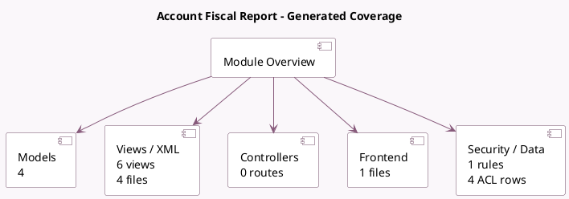

<!-- GENERATED:MODULE -->
---
tags: [odoo, enterprise, module]
---

# Account Fiscal Report

- Scope: Enterprise Addons
- Source: enterprise/account_fiscal_categories
- Dependencies: [[docs/Enterprise Addons/account_reports/account_reports|account_reports]]

## Summary

Account Fiscal Report

## Generated coverage

- Models: 4
- XML files with UI/data artifacts: 4
- Views: 6
- Actions: 2
- Menus: 2
- Rules (ir.rule): 1
- Access CSV entries: 4
- Controller units: 0
- Frontend asset files: 1

## Module map

## Detail notes

- Models: [[docs/Enterprise Addons/account_fiscal_categories/Models|Models]] (4)
- Views and XML: [[docs/Enterprise Addons/account_fiscal_categories/Views|Views]] (4 files)
- Frontend: [[docs/Enterprise Addons/account_fiscal_categories/Frontend|Frontend]] (1 files)

## Key models

- `account.account`
- `account.account.fiscal.rate`
- `account.fiscal.category`
- `account.fiscal.report.handler`

## Navigation

- [[../Enterprise Addons/Enterprise Addons|Back to scope]]
- [[../../docs/docs|Back to docs]]

<!-- GENERATED:MODULE -->

