<!-- GENERATED:MODEL -->
---
tags: [odoo, enterprise, generated, model]
---

# fleet.vehicle

- Module: [[docs/Enterprise Addons/account_fiscal_categories_fleet/account_fiscal_categories_fleet|account_fiscal_categories_fleet]]
- Scope: Enterprise Addons
- Defined in module: extension only
- Source files: `models/fleet_vehicle.py`
- Python classes: `FleetVehicle`

## Field footprint

- Detected fields: 1
- Field types: `One2many` x 1
- Relation fields: 1

## Sample fields

- `rate_ids`: `One2many` (comodel `fleet.disallowed.expenses.rate`)

## Method hints

- Detected methods: 0
- Action methods: none
- Compute methods: none
- Onchange methods: none

## Direct relation diagram

```plantuml
@startuml
!define ODOO_COLOR_PRIMARY #714B67
!define ODOO_COLOR_ACCENT #875A7B
!define ODOO_COLOR_BG #FAF7FA

skinparam backgroundColor ODOO_COLOR_BG
skinparam defaultTextAlignment left
skinparam ArrowColor ODOO_COLOR_ACCENT
skinparam ClassBackgroundColor white
skinparam ClassBorderColor ODOO_COLOR_PRIMARY
skinparam ComponentBackgroundColor white
skinparam ComponentBorderColor ODOO_COLOR_PRIMARY
skinparam NoteBackgroundColor #FFF8FF
skinparam NoteBorderColor ODOO_COLOR_ACCENT
skinparam SequenceLifeLineBorderColor ODOO_COLOR_ACCENT
skinparam SequenceLifeLineBackgroundColor #FFFFFF
skinparam SequenceParticipantBorderColor ODOO_COLOR_PRIMARY
skinparam SequenceParticipantBackgroundColor #FFFFFF
skinparam sequence {
  ArrowColor ODOO_COLOR_ACCENT
  ActorBorderColor ODOO_COLOR_PRIMARY
}
title fleet.vehicle - Direct Relations
class "fleet.vehicle" as fleet_vehicle
class "fleet.disallowed.expenses.rate" as fleet_disallowed_expenses_rate
fleet_vehicle --|> fleet_disallowed_expenses_rate : rate_ids
@enduml
```

## Navigation

- **Parent:** [[docs/Enterprise Addons/account_fiscal_categories_fleet/Models]]

<!-- GENERATED:MODEL -->
