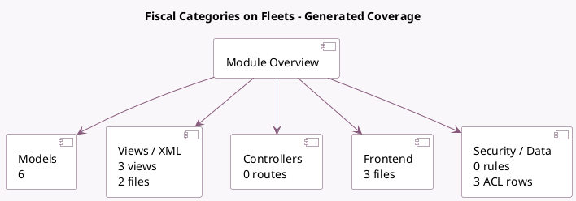

<!-- GENERATED:MODULE -->
---
tags: [odoo, enterprise, module]
---

# Fiscal Categories on Fleets

- Scope: Enterprise Addons
- Source: enterprise/account_fiscal_categories_fleet
- Dependencies: [[docs/Enterprise Addons/account_accountant_fleet/account_accountant_fleet|account_accountant_fleet]], [[docs/Enterprise Addons/account_fiscal_categories/account_fiscal_categories|account_fiscal_categories]]

## Summary

Manage fiscal categories with fleets

## Generated coverage

- Models: 6
- XML files with UI/data artifacts: 2
- Views: 3
- Actions: 0
- Menus: 0
- Rules (ir.rule): 0
- Access CSV entries: 3
- Controller units: 0
- Frontend asset files: 3

## Module map

## Detail notes

- Models: [[docs/Enterprise Addons/account_fiscal_categories_fleet/Models|Models]] (6)
- Views and XML: [[docs/Enterprise Addons/account_fiscal_categories_fleet/Views|Views]] (2 files)
- Frontend: [[docs/Enterprise Addons/account_fiscal_categories_fleet/Frontend|Frontend]] (3 files)

## Key models

- `account.deferred.report.handler`
- `account.fiscal.categories.fleet.report.handler`
- `account.fiscal.category`
- `account.move.line`
- `fleet.disallowed.expenses.rate`
- `fleet.vehicle`

## Navigation

- [[../Enterprise Addons/Enterprise Addons|Back to scope]]
- [[../../docs/docs|Back to docs]]

<!-- GENERATED:MODULE -->

