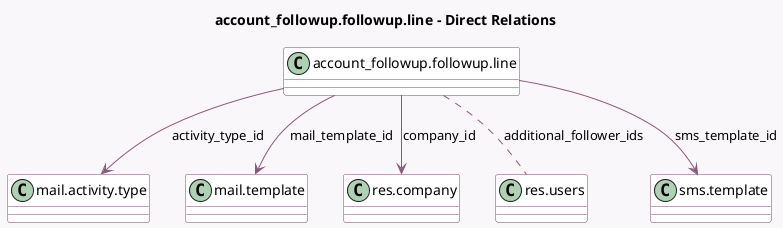

<!-- GENERATED:MODEL -->
---
tags: [odoo, enterprise, generated, model]
---

# account_followup.followup.line

- Module: [[docs/Enterprise Addons/account_followup/account_followup|account_followup]]
- Scope: Enterprise Addons
- Defined in module: yes
- Source files: `models/account_followup.py`
- Python classes: `Account_FollowupFollowupLine`
- Description: Follow-up Criteria

## Field footprint

- Detected fields: 15
- Field types: `Boolean` x 5, `Char` x 2, `Integer` x 1, `Many2many` x 1, `Many2one` x 4, `Selection` x 1, `Text` x 1
- Relation fields: 5

## Sample fields

- `activity_default_responsible_type`: `Selection`
- `activity_note`: `Text`
- `activity_summary`: `Char`
- `activity_type_id`: `Many2one` (comodel `mail.activity.type`)
- `additional_follower_ids`: `Many2many` (comodel `res.users`)
- `auto_execute`: `Boolean`
- `company_id`: `Many2one` (comodel `res.company`)
- `create_activity`: `Boolean`
- `delay`: `Integer` (comodel `Due Days`)
- `join_invoices`: `Boolean`
- `mail_template_id`: `Many2one` (comodel `mail.template`)
- `name`: `Char` (comodel `Description`)
- `send_email`: `Boolean` (comodel `Email`)
- `send_sms`: `Boolean` (comodel `SMS`)
- `sms_template_id`: `Many2one` (comodel `sms.template`)

## Method hints

- Detected methods: 5
- Action methods: none
- Compute methods: none
- Onchange methods: `_onchange_auto_execute`

## Direct relation diagram

## Navigation

- **Parent:** [[docs/Enterprise Addons/account_followup/Models]]

<!-- GENERATED:MODEL -->
