<!-- GENERATED:MODEL -->
---
tags: [odoo, enterprise, generated, model]
---

# account_followup.manual_reminder

- Module: [[docs/Enterprise Addons/account_followup/account_followup|account_followup]]
- Scope: Enterprise Addons
- Defined in module: yes
- Source files: `wizard/followup_manual_reminder.py`
- Python classes: `Account_FollowupManual_Reminder`
- Description: Wizard for sending manual reminders to clients
- Inherits: `mail.composer.mixin`

## Field footprint

- Detected fields: 11
- Field types: `Boolean` x 6, `Char` x 1, `Many2many` x 2, `Many2one` x 2
- Relation fields: 4

## Sample fields

- `attachment_ids`: `Many2many` (comodel `ir.attachment`)
- `email`: `Boolean`
- `email_recipient_ids`: `Many2many` (comodel `res.partner`, compute `_compute_email_recipient_ids`, store `True`)
- `join_invoices`: `Boolean`
- `partner_id`: `Many2one` (comodel `res.partner`)
- `print`: `Boolean`
- `show_print_button`: `Boolean` (compute `_compute_show_print_button`)
- `show_send_button`: `Boolean` (compute `_compute_show_send_button`)
- `sms`: `Boolean`
- `sms_body`: `Char` (compute `_compute_sms_body`, store `True`)
- `sms_template_id`: `Many2one` (comodel `sms.template`)

## Method hints

- Detected methods: 11
- Action methods: none
- Compute methods: `_compute_body`, `_compute_email_recipient_ids`, `_compute_render_model`, `_compute_show_print_button`, `_compute_show_send_button`, `_compute_sms_body`, `_compute_subject`
- Onchange methods: none

## Direct relation diagram

```plantuml
@startuml
!define ODOO_COLOR_PRIMARY #714B67
!define ODOO_COLOR_ACCENT #875A7B
!define ODOO_COLOR_BG #FAF7FA

skinparam backgroundColor ODOO_COLOR_BG
skinparam defaultTextAlignment left
skinparam ArrowColor ODOO_COLOR_ACCENT
skinparam ClassBackgroundColor white
skinparam ClassBorderColor ODOO_COLOR_PRIMARY
skinparam ComponentBackgroundColor white
skinparam ComponentBorderColor ODOO_COLOR_PRIMARY
skinparam NoteBackgroundColor #FFF8FF
skinparam NoteBorderColor ODOO_COLOR_ACCENT
skinparam SequenceLifeLineBorderColor ODOO_COLOR_ACCENT
skinparam SequenceLifeLineBackgroundColor #FFFFFF
skinparam SequenceParticipantBorderColor ODOO_COLOR_PRIMARY
skinparam SequenceParticipantBackgroundColor #FFFFFF
skinparam sequence {
  ArrowColor ODOO_COLOR_ACCENT
  ActorBorderColor ODOO_COLOR_PRIMARY
}
title account_followup.manual_reminder - Direct Relations
class "account_followup.manual_reminder" as account_followup_manual_reminder
class "ir.attachment" as ir_attachment
class "res.partner" as res_partner
class "sms.template" as sms_template
account_followup_manual_reminder --> res_partner : partner_id
account_followup_manual_reminder .. res_partner : email_recipient_ids
account_followup_manual_reminder --> sms_template : sms_template_id
account_followup_manual_reminder .. ir_attachment : attachment_ids
@enduml
```

## Navigation

- **Parent:** [[docs/Enterprise Addons/account_followup/Models]]

<!-- GENERATED:MODEL -->
