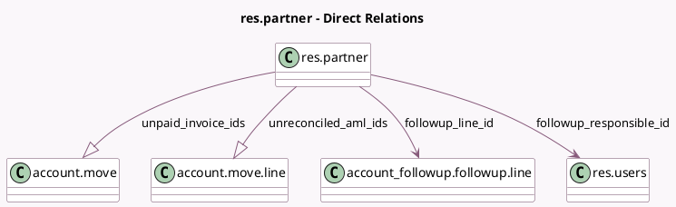

<!-- GENERATED:MODEL -->
---
tags: [odoo, enterprise, generated, model]
---

# res.partner

- Module: [[docs/Enterprise Addons/account_followup/account_followup|account_followup]]
- Scope: Enterprise Addons
- Defined in module: extension only
- Source files: `models/res_partner.py`
- Python classes: `ResPartner`

## Field footprint

- Detected fields: 14
- Field types: `Boolean` x 1, `Date` x 1, `Integer` x 1, `Many2one` x 2, `Monetary` x 5, `One2many` x 2, `Selection` x 2
- Relation fields: 4

## Sample fields

- `followup_line_id`: `Many2one` (comodel `account_followup.followup.line`, compute `_compute_followup_status`)
- `followup_next_action_date`: `Date`
- `followup_reminder_type`: `Selection`
- `followup_responsible_id`: `Many2one` (comodel `res.users`)
- `followup_status`: `Selection` (compute `_compute_followup_status`)
- `has_moves`: `Boolean` (compute `_compute_has_moves`)
- `total_all_due`: `Monetary` (compute `_compute_total_due`)
- `total_all_overdue`: `Monetary` (compute `_compute_total_due`)
- `total_due`: `Monetary` (compute `_compute_total_due`)
- `total_overdue`: `Monetary` (compute `_compute_total_due`)
- `total_overdue_followup`: `Monetary` (compute `_compute_total_due`)
- `unpaid_invoice_ids`: `One2many` (comodel `account.move`, compute `_compute_unpaid_invoices`)
- `unpaid_invoices_count`: `Integer` (compute `_compute_unpaid_invoices`)
- `unreconciled_aml_ids`: `One2many` (comodel `account.move.line`, compute `_compute_total_due`)

## Method hints

- Detected methods: 37
- Action methods: `action_manually_process_automatic_followups`, `action_open_overdue_entries`, `action_open_partner_followup_journal_items`, `action_open_unreconciled_partner`, `action_view_unpaid_invoices`
- Compute methods: `_compute_followup_status`, `_compute_has_moves`, `_compute_total_due`, `_compute_unpaid_invoices`
- Onchange methods: none

## Direct relation diagram

## Navigation

- **Parent:** [[docs/Enterprise Addons/account_followup/Models]]

<!-- GENERATED:MODEL -->
