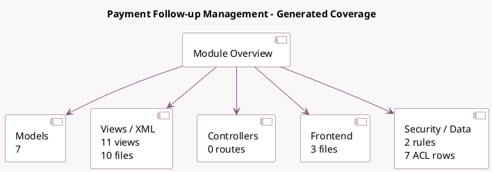

<!-- GENERATED:MODULE -->
---
tags: [odoo, enterprise, module]
---

# Payment Follow-up Management

- Scope: Enterprise Addons
- Source: enterprise/account_followup
- Dependencies: [[docs/Community Addons/mail/mail|mail]], [[docs/Community Addons/sms/sms|sms]], [[docs/Enterprise Addons/account_reports/account_reports|account_reports]]

## Generated coverage

- Models: 7
- XML files with UI/data artifacts: 10
- Views: 11
- Actions: 5
- Menus: 1
- Rules (ir.rule): 2
- Access CSV entries: 7
- Controller units: 0
- Frontend asset files: 3

## Module map

## Detail notes

- Models: [[docs/Enterprise Addons/account_followup/Models|Models]] (7)
- Views and XML: [[docs/Enterprise Addons/account_followup/Views|Views]] (10 files)
- Frontend: [[docs/Enterprise Addons/account_followup/Frontend|Frontend]] (3 files)

## Key models

- `account.followup.report`
- `account.move.line`
- `account_followup.followup.line`
- `account_followup.manual_reminder`
- `account_followup.missing.information.wizard`
- `ir.actions.report`
- `res.partner`

## Navigation

- [[../Enterprise Addons/Enterprise Addons|Back to scope]]
- [[../../docs/docs|Back to docs]]

<!-- GENERATED:MODULE -->

