<!-- GENERATED:MODEL -->
---
tags: [odoo, enterprise, generated, model]
---

# account.intrastat.code

- Module: [[docs/Enterprise Addons/account_intrastat/account_intrastat|account_intrastat]]
- Scope: Enterprise Addons
- Defined in module: yes
- Source files: `models/account_intrastat_code.py`
- Python classes: `AccountIntrastatCode`
- Description: Intrastat Code

## Field footprint

- Detected fields: 8
- Field types: `Char` x 3, `Date` x 2, `Many2one` x 1, `Selection` x 2
- Relation fields: 1

## Sample fields

- `code`: `Char`
- `country_id`: `Many2one` (comodel `res.country`)
- `description`: `Char`
- `expiry_date`: `Date`
- `name`: `Char`
- `start_date`: `Date`
- `supplementary_unit`: `Selection`
- `type`: `Selection`

## Method hints

- Detected methods: 1
- Action methods: none
- Compute methods: `_compute_display_name`
- Onchange methods: none

## Direct relation diagram

```plantuml
@startuml
!define ODOO_COLOR_PRIMARY #714B67
!define ODOO_COLOR_ACCENT #875A7B
!define ODOO_COLOR_BG #FAF7FA

skinparam backgroundColor ODOO_COLOR_BG
skinparam defaultTextAlignment left
skinparam ArrowColor ODOO_COLOR_ACCENT
skinparam ClassBackgroundColor white
skinparam ClassBorderColor ODOO_COLOR_PRIMARY
skinparam ComponentBackgroundColor white
skinparam ComponentBorderColor ODOO_COLOR_PRIMARY
skinparam NoteBackgroundColor #FFF8FF
skinparam NoteBorderColor ODOO_COLOR_ACCENT
skinparam SequenceLifeLineBorderColor ODOO_COLOR_ACCENT
skinparam SequenceLifeLineBackgroundColor #FFFFFF
skinparam SequenceParticipantBorderColor ODOO_COLOR_PRIMARY
skinparam SequenceParticipantBackgroundColor #FFFFFF
skinparam sequence {
  ArrowColor ODOO_COLOR_ACCENT
  ActorBorderColor ODOO_COLOR_PRIMARY
}
title account.intrastat.code - Direct Relations
class "account.intrastat.code" as account_intrastat_code
class "res.country" as res_country
account_intrastat_code --> res_country : country_id
@enduml
```

## Navigation

- **Parent:** [[docs/Enterprise Addons/account_intrastat/Models]]

<!-- GENERATED:MODEL -->
