<!-- GENERATED:MODEL -->
---
tags: [odoo, enterprise, generated, model]
---

# product.template

- Module: [[docs/Enterprise Addons/account_intrastat/account_intrastat|account_intrastat]]
- Scope: Enterprise Addons
- Defined in module: extension only
- Source files: `models/product.py`
- Python classes: `ProductTemplate`

## Field footprint

- Detected fields: 7
- Field types: `Char` x 1, `Float` x 1, `Json` x 1, `Many2many` x 1, `Many2one` x 2, `Selection` x 1
- Relation fields: 3

## Sample fields

- `account_fiscal_country_group_codes`: `Json` (related `company_id.account_fiscal_country_group_codes`)
- `intrastat_code_domain`: `Char` (compute `_compute_intrastat_code_domain`)
- `intrastat_code_id`: `Many2one` (comodel `account.intrastat.code`, compute `_compute_intrastat_values`)
- `intrastat_origin_country_id`: `Many2one` (comodel `res.country`, compute `_compute_intrastat_values`)
- `intrastat_supplementary_unit`: `Selection` (compute `_compute_intrastat_values`)
- `intrastat_supplementary_unit_amount`: `Float` (compute `_compute_intrastat_values`)
- `valid_intrastat_code_ids`: `Many2many` (comodel `account.intrastat.code`, compute `_compute_valid_intrastat_code_ids`)

## Method hints

- Detected methods: 7
- Action methods: none
- Compute methods: `_compute_intrastat_code_domain`, `_compute_intrastat_values`, `_compute_valid_intrastat_code_ids`
- Onchange methods: none

## Direct relation diagram

```plantuml
@startuml
!define ODOO_COLOR_PRIMARY #714B67
!define ODOO_COLOR_ACCENT #875A7B
!define ODOO_COLOR_BG #FAF7FA

skinparam backgroundColor ODOO_COLOR_BG
skinparam defaultTextAlignment left
skinparam ArrowColor ODOO_COLOR_ACCENT
skinparam ClassBackgroundColor white
skinparam ClassBorderColor ODOO_COLOR_PRIMARY
skinparam ComponentBackgroundColor white
skinparam ComponentBorderColor ODOO_COLOR_PRIMARY
skinparam NoteBackgroundColor #FFF8FF
skinparam NoteBorderColor ODOO_COLOR_ACCENT
skinparam SequenceLifeLineBorderColor ODOO_COLOR_ACCENT
skinparam SequenceLifeLineBackgroundColor #FFFFFF
skinparam SequenceParticipantBorderColor ODOO_COLOR_PRIMARY
skinparam SequenceParticipantBackgroundColor #FFFFFF
skinparam sequence {
  ArrowColor ODOO_COLOR_ACCENT
  ActorBorderColor ODOO_COLOR_PRIMARY
}
title product.template - Direct Relations
class "product.template" as product_template
class "account.intrastat.code" as account_intrastat_code
class "res.country" as res_country
product_template --> account_intrastat_code : intrastat_code_id
product_template --> res_country : intrastat_origin_country_id
product_template .. account_intrastat_code : valid_intrastat_code_ids
@enduml
```

## Navigation

- **Parent:** [[docs/Enterprise Addons/account_intrastat/Models]]

<!-- GENERATED:MODEL -->
