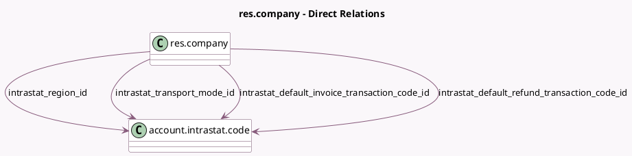

<!-- GENERATED:MODEL -->
---
tags: [odoo, enterprise, generated, model]
---

# res.company

- Module: [[docs/Enterprise Addons/account_intrastat/account_intrastat|account_intrastat]]
- Scope: Enterprise Addons
- Defined in module: extension only
- Source files: `models/res_company.py`
- Python classes: `ResCompany`

## Field footprint

- Detected fields: 4
- Field types: `Many2one` x 4
- Relation fields: 4

## Sample fields

- `intrastat_default_invoice_transaction_code_id`: `Many2one` (comodel `account.intrastat.code`)
- `intrastat_default_refund_transaction_code_id`: `Many2one` (comodel `account.intrastat.code`)
- `intrastat_region_id`: `Many2one` (comodel `account.intrastat.code`)
- `intrastat_transport_mode_id`: `Many2one` (comodel `account.intrastat.code`)

## Method hints

- Detected methods: 0
- Action methods: none
- Compute methods: none
- Onchange methods: none

## Direct relation diagram

## Navigation

- **Parent:** [[docs/Enterprise Addons/account_intrastat/Models]]

<!-- GENERATED:MODEL -->
