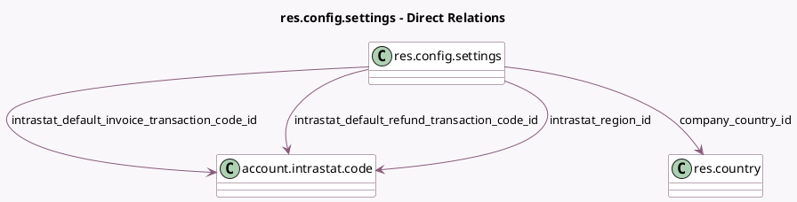

<!-- GENERATED:MODEL -->
---
tags: [odoo, enterprise, generated, model]
---

# res.config.settings

- Module: [[docs/Enterprise Addons/account_intrastat/account_intrastat|account_intrastat]]
- Scope: Enterprise Addons
- Defined in module: extension only
- Source files: `models/res_config_settings.py`
- Python classes: `ResConfigSettings`

## Field footprint

- Detected fields: 5
- Field types: `Boolean` x 1, `Many2one` x 4
- Relation fields: 4

## Sample fields

- `company_country_id`: `Many2one` (comodel `res.country`, related `company_id.account_fiscal_country_id`)
- `has_country_regions`: `Boolean` (compute `_compute_has_country_regions`)
- `intrastat_default_invoice_transaction_code_id`: `Many2one` (comodel `account.intrastat.code`, related `company_id.intrastat_default_invoice_transaction_code_id`)
- `intrastat_default_refund_transaction_code_id`: `Many2one` (comodel `account.intrastat.code`, related `company_id.intrastat_default_refund_transaction_code_id`)
- `intrastat_region_id`: `Many2one` (comodel `account.intrastat.code`, related `company_id.intrastat_region_id`)

## Method hints

- Detected methods: 1
- Action methods: none
- Compute methods: `_compute_has_country_regions`
- Onchange methods: none

## Direct relation diagram

## Navigation

- **Parent:** [[docs/Enterprise Addons/account_intrastat/Models]]

<!-- GENERATED:MODEL -->
