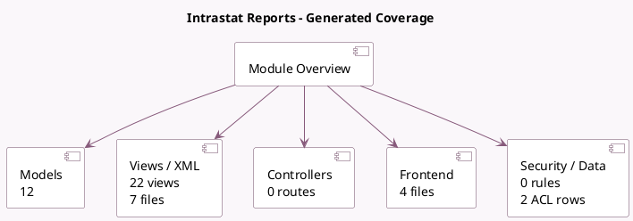

<!-- GENERATED:MODULE -->
---
tags: [odoo, enterprise, module]
---

# Intrastat Reports

- Scope: Enterprise Addons
- Source: enterprise/account_intrastat
- Dependencies: [[docs/Enterprise Addons/account_reports/account_reports|account_reports]]

## Generated coverage

- Models: 12
- XML files with UI/data artifacts: 7
- Views: 22
- Actions: 2
- Menus: 3
- Rules (ir.rule): 0
- Access CSV entries: 2
- Controller units: 0
- Frontend asset files: 4

## Module map

## Detail notes

- Models: [[docs/Enterprise Addons/account_intrastat/Models|Models]] (12)
- Views and XML: [[docs/Enterprise Addons/account_intrastat/Views|Views]] (7 files)
- Frontend: [[docs/Enterprise Addons/account_intrastat/Frontend|Frontend]] (4 files)

## Key models

- `account.intrastat.code`
- `account.intrastat.goods.report.handler`
- `account.intrastat.report.handler`
- `account.intrastat.services.report.handler`
- `account.move`
- `account.move.line`
- `account.return`
- `account.return.type`
- `product.product`
- `product.template`
- `res.company`
- `res.config.settings`

## Navigation

- [[../Enterprise Addons/Enterprise Addons|Back to scope]]
- [[../../docs/docs|Back to docs]]

<!-- GENERATED:MODULE -->

