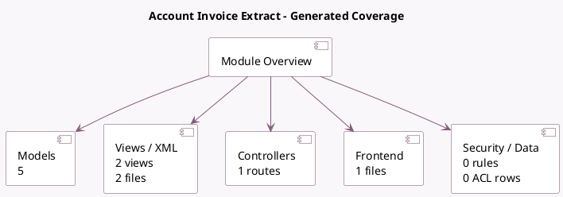

<!-- GENERATED:MODULE -->
---
tags: [odoo, enterprise, module]
---

# Account Invoice Extract

- Scope: Enterprise Addons
- Source: enterprise/account_invoice_extract
- Dependencies: [[docs/Enterprise Addons/account_extract/account_extract|account_extract]]

## Summary

Extract data from invoice scans to fill them automatically

## Generated coverage

- Models: 5
- XML files with UI/data artifacts: 2
- Views: 2
- Actions: 1
- Menus: 0
- Rules (ir.rule): 0
- Access CSV entries: 0
- Controller units: 1
- Frontend asset files: 1

## Module map

## Detail notes

- Models: [[docs/Enterprise Addons/account_invoice_extract/Models|Models]] (5)
- Views and XML: [[docs/Enterprise Addons/account_invoice_extract/Views|Views]] (2 files)
- Controllers: [[docs/Enterprise Addons/account_invoice_extract/Controllers|Controllers]] (1)
- Frontend: [[docs/Enterprise Addons/account_invoice_extract/Frontend|Frontend]] (1 files)

## Key models

- `account.move`
- `ir.attachment`
- `res.company`
- `res.config.settings`
- `res.partner`

## Navigation

- [[../Enterprise Addons/Enterprise Addons|Back to scope]]
- [[../../docs/docs|Back to docs]]

<!-- GENERATED:MODULE -->

