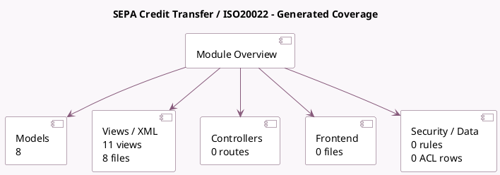

<!-- GENERATED:MODULE -->
---
tags: [odoo, enterprise, module]
---

# SEPA Credit Transfer / ISO20022

- Scope: Enterprise Addons
- Source: enterprise/account_iso20022
- Dependencies: [[docs/Enterprise Addons/account_batch_payment/account_batch_payment|account_batch_payment]], [[docs/Community Addons/base_iban/base_iban|base_iban]]

## Summary

Export payments as SEPA Credit Transfer or ISO20022 files

## Generated coverage

- Models: 8
- XML files with UI/data artifacts: 8
- Views: 11
- Actions: 0
- Menus: 0
- Rules (ir.rule): 0
- Access CSV entries: 0
- Controller units: 0
- Frontend asset files: 0

## Module map

## Detail notes

- Models: [[docs/Enterprise Addons/account_iso20022/Models|Models]] (8)
- Views and XML: [[docs/Enterprise Addons/account_iso20022/Views|Views]] (8 files)

## Key models

- `account.bank.statement.line`
- `account.batch.payment`
- `account.journal`
- `account.payment`
- `account.payment.method`
- `res.company`
- `res.config.settings`
- `res.partner`

## Navigation

- [[../Enterprise Addons/Enterprise Addons|Back to scope]]
- [[../../docs/docs|Back to docs]]

<!-- GENERATED:MODULE -->

