<!-- GENERATED:MODEL -->
---
tags: [odoo, enterprise, generated, model]
---

# account.asset.group

- Module: [[docs/Enterprise Addons/account_loans/account_loans|account_loans]]
- Scope: Enterprise Addons
- Defined in module: extension only
- Source files: `models/account_asset_group.py`
- Python classes: `AccountAssetGroup`

## Field footprint

- Detected fields: 2
- Field types: `Integer` x 1, `One2many` x 1
- Relation fields: 1

## Sample fields

- `count_linked_loans`: `Integer` (compute `_compute_count_linked_loans`)
- `linked_loan_ids`: `One2many` (comodel `account.loan`)

## Method hints

- Detected methods: 2
- Action methods: `action_open_linked_loans`
- Compute methods: `_compute_count_linked_loans`
- Onchange methods: none

## Direct relation diagram

```plantuml
@startuml
!define ODOO_COLOR_PRIMARY #714B67
!define ODOO_COLOR_ACCENT #875A7B
!define ODOO_COLOR_BG #FAF7FA

skinparam backgroundColor ODOO_COLOR_BG
skinparam defaultTextAlignment left
skinparam ArrowColor ODOO_COLOR_ACCENT
skinparam ClassBackgroundColor white
skinparam ClassBorderColor ODOO_COLOR_PRIMARY
skinparam ComponentBackgroundColor white
skinparam ComponentBorderColor ODOO_COLOR_PRIMARY
skinparam NoteBackgroundColor #FFF8FF
skinparam NoteBorderColor ODOO_COLOR_ACCENT
skinparam SequenceLifeLineBorderColor ODOO_COLOR_ACCENT
skinparam SequenceLifeLineBackgroundColor #FFFFFF
skinparam SequenceParticipantBorderColor ODOO_COLOR_PRIMARY
skinparam SequenceParticipantBackgroundColor #FFFFFF
skinparam sequence {
  ArrowColor ODOO_COLOR_ACCENT
  ActorBorderColor ODOO_COLOR_PRIMARY
}
title account.asset.group - Direct Relations
class "account.asset.group" as account_asset_group
class "account.loan" as account_loan
account_asset_group --|> account_loan : linked_loan_ids
@enduml
```

## Navigation

- **Parent:** [[docs/Enterprise Addons/account_loans/Models]]

<!-- GENERATED:MODEL -->
