<!-- GENERATED:MODEL -->
---
tags: [odoo, enterprise, generated, model]
---

# account.loan.line

- Module: [[docs/Enterprise Addons/account_loans/account_loans|account_loans]]
- Scope: Enterprise Addons
- Defined in module: yes
- Source files: `models/account_loan_line.py`
- Python classes: `AccountLoanLine`
- Description: Loan Line

## Field footprint

- Detected fields: 18
- Field types: `Boolean` x 2, `Char` x 1, `Date` x 2, `Integer` x 1, `Many2one` x 4, `Monetary` x 6, `One2many` x 1, `Selection` x 1
- Relation fields: 5

## Sample fields

- `active`: `Boolean` (related `loan_id.active`)
- `company_id`: `Many2one` (related `loan_id.company_id`)
- `currency_id`: `Many2one` (related `company_id.currency_id`)
- `date`: `Date` (comodel `Date`)
- `generated_move_ids`: `One2many` (comodel `account.move`)
- `interest`: `Monetary`
- `is_payment_move_posted`: `Boolean` (compute `_compute_is_payment_move_posted`)
- `loan_asset_group_id`: `Many2one` (related `loan_id.asset_group_id`)
- `loan_date`: `Date` (related `loan_id.date`)
- `loan_id`: `Many2one` (comodel `account.loan`)
- `loan_name`: `Char` (related `loan_id.name`)
- `loan_state`: `Selection` (related `loan_id.state`)
- `long_term_theoretical_balance`: `Monetary` (compute `_compute_theoretical_balances`, store `True`)
- `outstanding_balance`: `Monetary` (compute `_compute_outstanding_balance`)
- `payment`: `Monetary` (compute `_compute_payment`, store `True`)
- `principal`: `Monetary`
- `sequence`: `Integer` (comodel `#`, compute `_compute_sequence`)
- `short_term_theoretical_balance`: `Monetary` (compute `_compute_theoretical_balances`, store `True`)

## Method hints

- Detected methods: 5
- Action methods: none
- Compute methods: `_compute_is_payment_move_posted`, `_compute_outstanding_balance`, `_compute_payment`, `_compute_sequence`, `_compute_theoretical_balances`
- Onchange methods: none

## Direct relation diagram

```plantuml
@startuml
!define ODOO_COLOR_PRIMARY #714B67
!define ODOO_COLOR_ACCENT #875A7B
!define ODOO_COLOR_BG #FAF7FA

skinparam backgroundColor ODOO_COLOR_BG
skinparam defaultTextAlignment left
skinparam ArrowColor ODOO_COLOR_ACCENT
skinparam ClassBackgroundColor white
skinparam ClassBorderColor ODOO_COLOR_PRIMARY
skinparam ComponentBackgroundColor white
skinparam ComponentBorderColor ODOO_COLOR_PRIMARY
skinparam NoteBackgroundColor #FFF8FF
skinparam NoteBorderColor ODOO_COLOR_ACCENT
skinparam SequenceLifeLineBorderColor ODOO_COLOR_ACCENT
skinparam SequenceLifeLineBackgroundColor #FFFFFF
skinparam SequenceParticipantBorderColor ODOO_COLOR_PRIMARY
skinparam SequenceParticipantBackgroundColor #FFFFFF
skinparam sequence {
  ArrowColor ODOO_COLOR_ACCENT
  ActorBorderColor ODOO_COLOR_PRIMARY
}
title account.loan.line - Direct Relations
class "account.loan.line" as account_loan_line
class "account.loan" as account_loan
class "account.move" as account_move
account_loan_line --> account_loan : loan_id
account_loan_line --|> account_move : generated_move_ids
@enduml
```

## Navigation

- **Parent:** [[docs/Enterprise Addons/account_loans/Models]]

<!-- GENERATED:MODEL -->
