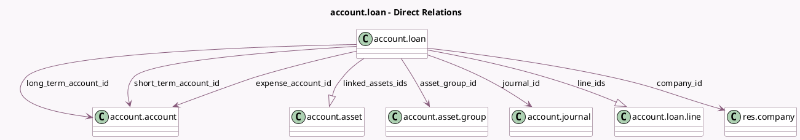

<!-- GENERATED:MODEL -->
---
tags: [odoo, enterprise, generated, model]
---

# account.loan

- Module: [[docs/Enterprise Addons/account_loans/account_loans|account_loans]]
- Scope: Enterprise Addons
- Defined in module: yes
- Source files: `models/account_loan.py`
- Python classes: `AccountLoan`
- Description: Loan
- Inherits: `mail.thread`

## Field footprint

- Detected fields: 28
- Field types: `Boolean` x 2, `Char` x 2, `Date` x 4, `Integer` x 4, `Many2one` x 7, `Monetary` x 5, `One2many` x 2, `Properties` x 1, `Selection` x 1
- Relation fields: 9

## Sample fields

- `active`: `Boolean`
- `amount_borrowed`: `Monetary`
- `amount_borrowed_difference`: `Monetary` (compute `_compute_amount_borrowed_difference`)
- `asset_group_id`: `Many2one` (comodel `account.asset.group`)
- `company_id`: `Many2one` (comodel `res.company`)
- `count_linked_assets`: `Integer` (compute `_compute_linked_assets`)
- `currency_id`: `Many2one` (related `company_id.currency_id`)
- `date`: `Date` (comodel `Loan Date`)
- `display_name`: `Char` (store `True`)
- `duration`: `Integer` (comodel `Duration`)
- `duration_difference`: `Integer` (compute `_compute_duration_difference`)
- `end_date`: `Date` (compute `_compute_start_end_date`)
- `expense_account_id`: `Many2one` (comodel `account.account`)
- `interest`: `Monetary`
- `interest_difference`: `Monetary` (compute `_compute_interest_difference`)
- `is_wrong_date`: `Boolean` (compute `_compute_is_wrong_date`)
- `journal_id`: `Many2one` (comodel `account.journal`)
- `line_ids`: `One2many` (comodel `account.loan.line`)
- `linked_assets_ids`: `One2many` (comodel `account.asset`, compute `_compute_linked_assets`)
- `loan_properties`: `Properties` (comodel `Properties`)

## Method hints

- Detected methods: 22
- Action methods: `action_cancel`, `action_close`, `action_confirm`, `action_file_uploaded`, `action_open_compute_wizard`, `action_open_linked_assets`, `action_open_loan_entries`, `action_reset`, and 2 more
- Compute methods: `_compute_amount_borrowed_difference`, `_compute_display_name`, `_compute_duration_difference`, `_compute_interest_difference`, `_compute_is_wrong_date`, `_compute_linked_assets`, `_compute_nb_posted_entries`, `_compute_outstanding_balance`, and 1 more
- Onchange methods: none

## Direct relation diagram

## Navigation

- **Parent:** [[docs/Enterprise Addons/account_loans/Models]]

<!-- GENERATED:MODEL -->
