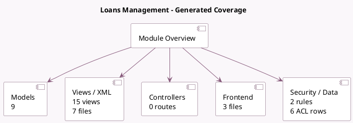

<!-- GENERATED:MODULE -->
---
tags: [odoo, enterprise, module]
---

# Loans Management

- Scope: Enterprise Addons
- Source: enterprise/account_loans
- Dependencies: [[docs/Enterprise Addons/account_asset/account_asset|account_asset]], [[docs/Community Addons/base_import/base_import|base_import]]

## Generated coverage

- Models: 9
- XML files with UI/data artifacts: 7
- Views: 15
- Actions: 4
- Menus: 2
- Rules (ir.rule): 2
- Access CSV entries: 6
- Controller units: 0
- Frontend asset files: 3

## Module map

## Detail notes

- Models: [[docs/Enterprise Addons/account_loans/Models|Models]] (9)
- Views and XML: [[docs/Enterprise Addons/account_loans/Views|Views]] (7 files)
- Frontend: [[docs/Enterprise Addons/account_loans/Frontend|Frontend]] (3 files)

## Key models

- `account.asset`
- `account.asset.group`
- `account.journal`
- `account.loan`
- `account.loan.close.wizard`
- `account.loan.compute.wizard`
- `account.loan.line`
- `account.move`
- `account.return`

## Navigation

- [[../Enterprise Addons/Enterprise Addons|Back to scope]]
- [[../../docs/docs|Back to docs]]

<!-- GENERATED:MODULE -->

