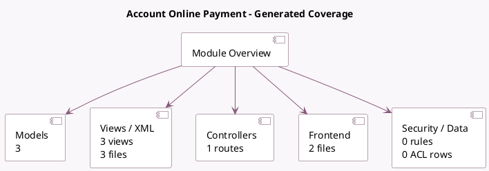

<!-- GENERATED:MODULE -->
---
tags: [odoo, enterprise, module]
---

# Account Online Payment

- Scope: Enterprise Addons
- Source: enterprise/account_online_payment
- Dependencies: [[docs/Enterprise Addons/account_online_synchronization/account_online_synchronization|account_online_synchronization]], [[docs/Enterprise Addons/account_batch_payment/account_batch_payment|account_batch_payment]], [[docs/Enterprise Addons/account_iso20022/account_iso20022|account_iso20022]]

## Summary

Initiate online payments

## Generated coverage

- Models: 3
- XML files with UI/data artifacts: 3
- Views: 3
- Actions: 1
- Menus: 0
- Rules (ir.rule): 0
- Access CSV entries: 0
- Controller units: 1
- Frontend asset files: 2

## Module map

## Detail notes

- Models: [[docs/Enterprise Addons/account_online_payment/Models|Models]] (3)
- Views and XML: [[docs/Enterprise Addons/account_online_payment/Views|Views]] (3 files)
- Controllers: [[docs/Enterprise Addons/account_online_payment/Controllers|Controllers]] (1)
- Frontend: [[docs/Enterprise Addons/account_online_payment/Frontend|Frontend]] (2 files)

## Key models

- `account.batch.payment`
- `account.online.link`
- `account.payment`

## Navigation

- [[../Enterprise Addons/Enterprise Addons|Back to scope]]
- [[../../docs/docs|Back to docs]]

<!-- GENERATED:MODULE -->

