<!-- GENERATED:MODEL -->
---
tags: [odoo, enterprise, generated, model]
---

# account.bank.selection

- Module: [[docs/Enterprise Addons/account_online_synchronization/account_online_synchronization|account_online_synchronization]]
- Scope: Enterprise Addons
- Defined in module: yes
- Source files: `wizard/account_bank_selection_wizard.py`
- Python classes: `AccountBankSelection`
- Description: Link a bank account to the selected journal

## Field footprint

- Detected fields: 4
- Field types: `Char` x 1, `Many2one` x 2, `One2many` x 1
- Relation fields: 3

## Sample fields

- `account_online_account_ids`: `One2many` (comodel `account.online.account`, compute `_compute_online_account`)
- `account_online_link_id`: `Many2one` (comodel `account.online.link`)
- `institution_name`: `Char` (related `account_online_link_id.name`)
- `selected_account`: `Many2one` (comodel `account.online.account`)

## Method hints

- Detected methods: 2
- Action methods: none
- Compute methods: `_compute_online_account`
- Onchange methods: none

## Direct relation diagram

```plantuml
@startuml
!define ODOO_COLOR_PRIMARY #714B67
!define ODOO_COLOR_ACCENT #875A7B
!define ODOO_COLOR_BG #FAF7FA

skinparam backgroundColor ODOO_COLOR_BG
skinparam defaultTextAlignment left
skinparam ArrowColor ODOO_COLOR_ACCENT
skinparam ClassBackgroundColor white
skinparam ClassBorderColor ODOO_COLOR_PRIMARY
skinparam ComponentBackgroundColor white
skinparam ComponentBorderColor ODOO_COLOR_PRIMARY
skinparam NoteBackgroundColor #FFF8FF
skinparam NoteBorderColor ODOO_COLOR_ACCENT
skinparam SequenceLifeLineBorderColor ODOO_COLOR_ACCENT
skinparam SequenceLifeLineBackgroundColor #FFFFFF
skinparam SequenceParticipantBorderColor ODOO_COLOR_PRIMARY
skinparam SequenceParticipantBackgroundColor #FFFFFF
skinparam sequence {
  ArrowColor ODOO_COLOR_ACCENT
  ActorBorderColor ODOO_COLOR_PRIMARY
}
title account.bank.selection - Direct Relations
class "account.bank.selection" as account_bank_selection
class "account.online.account" as account_online_account
class "account.online.link" as account_online_link
account_bank_selection --> account_online_link : account_online_link_id
account_bank_selection --|> account_online_account : account_online_account_ids
account_bank_selection --> account_online_account : selected_account
@enduml
```

## Navigation

- **Parent:** [[docs/Enterprise Addons/account_online_synchronization/Models]]

<!-- GENERATED:MODEL -->
