<!-- GENERATED:MODEL -->
---
tags: [odoo, enterprise, generated, model]
---

# account.bank.statement.line

- Module: [[docs/Enterprise Addons/account_online_synchronization/account_online_synchronization|account_online_synchronization]]
- Scope: Enterprise Addons
- Defined in module: extension only
- Source files: `models/account_bank_statement.py`
- Python classes: `AccountBankStatementLine`

## Field footprint

- Detected fields: 4
- Field types: `Char` x 2, `Many2one` x 2
- Relation fields: 2

## Sample fields

- `online_account_id`: `Many2one` (comodel `account.online.account`)
- `online_link_id`: `Many2one` (comodel `account.online.link`, related `online_account_id.account_online_link_id`, store `True`)
- `online_partner_information`: `Char`
- `online_transaction_identifier`: `Char` (comodel `Online Transaction Identifier`)

## Method hints

- Detected methods: 2
- Action methods: none
- Compute methods: none
- Onchange methods: none

## Direct relation diagram

```plantuml
@startuml
!define ODOO_COLOR_PRIMARY #714B67
!define ODOO_COLOR_ACCENT #875A7B
!define ODOO_COLOR_BG #FAF7FA

skinparam backgroundColor ODOO_COLOR_BG
skinparam defaultTextAlignment left
skinparam ArrowColor ODOO_COLOR_ACCENT
skinparam ClassBackgroundColor white
skinparam ClassBorderColor ODOO_COLOR_PRIMARY
skinparam ComponentBackgroundColor white
skinparam ComponentBorderColor ODOO_COLOR_PRIMARY
skinparam NoteBackgroundColor #FFF8FF
skinparam NoteBorderColor ODOO_COLOR_ACCENT
skinparam SequenceLifeLineBorderColor ODOO_COLOR_ACCENT
skinparam SequenceLifeLineBackgroundColor #FFFFFF
skinparam SequenceParticipantBorderColor ODOO_COLOR_PRIMARY
skinparam SequenceParticipantBackgroundColor #FFFFFF
skinparam sequence {
  ArrowColor ODOO_COLOR_ACCENT
  ActorBorderColor ODOO_COLOR_PRIMARY
}
title account.bank.statement.line - Direct Relations
class "account.bank.statement.line" as account_bank_statement_line
class "account.online.account" as account_online_account
class "account.online.link" as account_online_link
account_bank_statement_line --> account_online_account : online_account_id
account_bank_statement_line --> account_online_link : online_link_id
@enduml
```

## Navigation

- **Parent:** [[docs/Enterprise Addons/account_online_synchronization/Models]]

<!-- GENERATED:MODEL -->
