<!-- GENERATED:MODEL -->
---
tags: [odoo, enterprise, generated, model]
---

# account.bank.statement.line.transient

- Module: [[docs/Enterprise Addons/account_online_synchronization/account_online_synchronization|account_online_synchronization]]
- Scope: Enterprise Addons
- Defined in module: yes
- Source files: `wizard/account_bank_statement_line.py`
- Python classes: `AccountBankStatementLineTransient`
- Description: Transient model for bank statement line

## Field footprint

- Detected fields: 15
- Field types: `Char` x 4, `Date` x 1, `Integer` x 1, `Json` x 1, `Many2one` x 5, `Monetary` x 2, `Selection` x 1
- Relation fields: 5

## Sample fields

- `account_number`: `Char`
- `amount`: `Monetary`
- `amount_currency`: `Monetary`
- `company_id`: `Many2one` (comodel `res.company`)
- `currency_id`: `Many2one` (related `journal_id.company_id.currency_id`)
- `date`: `Date`
- `foreign_currency_id`: `Many2one` (comodel `res.currency`)
- `journal_id`: `Many2one` (comodel `account.journal`)
- `online_account_id`: `Many2one` (related `journal_id.account_online_account_id`, store `True`)
- `online_transaction_identifier`: `Char`
- `partner_name`: `Char`
- `payment_ref`: `Char`
- `sequence`: `Integer`
- `state`: `Selection`
- `transaction_details`: `Json`

## Method hints

- Detected methods: 2
- Action methods: `action_import_transactions`
- Compute methods: none
- Onchange methods: none

## Direct relation diagram

```plantuml
@startuml
!define ODOO_COLOR_PRIMARY #714B67
!define ODOO_COLOR_ACCENT #875A7B
!define ODOO_COLOR_BG #FAF7FA

skinparam backgroundColor ODOO_COLOR_BG
skinparam defaultTextAlignment left
skinparam ArrowColor ODOO_COLOR_ACCENT
skinparam ClassBackgroundColor white
skinparam ClassBorderColor ODOO_COLOR_PRIMARY
skinparam ComponentBackgroundColor white
skinparam ComponentBorderColor ODOO_COLOR_PRIMARY
skinparam NoteBackgroundColor #FFF8FF
skinparam NoteBorderColor ODOO_COLOR_ACCENT
skinparam SequenceLifeLineBorderColor ODOO_COLOR_ACCENT
skinparam SequenceLifeLineBackgroundColor #FFFFFF
skinparam SequenceParticipantBorderColor ODOO_COLOR_PRIMARY
skinparam SequenceParticipantBackgroundColor #FFFFFF
skinparam sequence {
  ArrowColor ODOO_COLOR_ACCENT
  ActorBorderColor ODOO_COLOR_PRIMARY
}
title account.bank.statement.line.transient - Direct Relations
class "account.bank.statement.line.transient" as account_bank_statement_line_transient
class "account.journal" as account_journal
class "res.company" as res_company
class "res.currency" as res_currency
account_bank_statement_line_transient --> account_journal : journal_id
account_bank_statement_line_transient --> res_company : company_id
account_bank_statement_line_transient --> res_currency : foreign_currency_id
@enduml
```

## Navigation

- **Parent:** [[docs/Enterprise Addons/account_online_synchronization/Models]]

<!-- GENERATED:MODEL -->
