<!-- GENERATED:MODEL -->
---
tags: [odoo, enterprise, generated, model]
---

# account.duplicate.transaction.wizard

- Module: [[docs/Enterprise Addons/account_online_synchronization/account_online_synchronization|account_online_synchronization]]
- Scope: Enterprise Addons
- Defined in module: yes
- Source files: `wizard/account_journal_duplicate_transactions.py`
- Python classes: `AccountDuplicateTransactionWizard`
- Description: Wizard for duplicate transactions

## Field footprint

- Detected fields: 5
- Field types: `Date` x 1, `Json` x 1, `Many2one` x 1, `One2many` x 2
- Relation fields: 3

## Sample fields

- `date`: `Date` (compute `_compute_date`, store `True`)
- `first_ids_in_group`: `Json` (compute `_compute_transaction_ids`)
- `journal_id`: `Many2one` (comodel `account.journal`)
- `provider_duplicate_ids`: `One2many` (comodel `account.bank.statement.line`, compute `_compute_provider_duplicate_ids`)
- `transaction_ids`: `One2many` (comodel `account.bank.statement.line`, compute `_compute_transaction_ids`)

## Method hints

- Detected methods: 4
- Action methods: none
- Compute methods: `_compute_date`, `_compute_display_name`, `_compute_provider_duplicate_ids`, `_compute_transaction_ids`
- Onchange methods: none

## Direct relation diagram

```plantuml
@startuml
!define ODOO_COLOR_PRIMARY #714B67
!define ODOO_COLOR_ACCENT #875A7B
!define ODOO_COLOR_BG #FAF7FA

skinparam backgroundColor ODOO_COLOR_BG
skinparam defaultTextAlignment left
skinparam ArrowColor ODOO_COLOR_ACCENT
skinparam ClassBackgroundColor white
skinparam ClassBorderColor ODOO_COLOR_PRIMARY
skinparam ComponentBackgroundColor white
skinparam ComponentBorderColor ODOO_COLOR_PRIMARY
skinparam NoteBackgroundColor #FFF8FF
skinparam NoteBorderColor ODOO_COLOR_ACCENT
skinparam SequenceLifeLineBorderColor ODOO_COLOR_ACCENT
skinparam SequenceLifeLineBackgroundColor #FFFFFF
skinparam SequenceParticipantBorderColor ODOO_COLOR_PRIMARY
skinparam SequenceParticipantBackgroundColor #FFFFFF
skinparam sequence {
  ArrowColor ODOO_COLOR_ACCENT
  ActorBorderColor ODOO_COLOR_PRIMARY
}
title account.duplicate.transaction.wizard - Direct Relations
class "account.duplicate.transaction.wizard" as account_duplicate_transaction_wizard
class "account.bank.statement.line" as account_bank_statement_line
class "account.journal" as account_journal
account_duplicate_transaction_wizard --> account_journal : journal_id
account_duplicate_transaction_wizard --|> account_bank_statement_line : transaction_ids
account_duplicate_transaction_wizard --|> account_bank_statement_line : provider_duplicate_ids
@enduml
```

## Navigation

- **Parent:** [[docs/Enterprise Addons/account_online_synchronization/Models]]

<!-- GENERATED:MODEL -->
