<!-- GENERATED:MODEL -->
---
tags: [odoo, enterprise, generated, model]
---

# account.journal

- Module: [[docs/Enterprise Addons/account_online_synchronization/account_online_synchronization|account_online_synchronization]]
- Scope: Enterprise Addons
- Defined in module: extension only
- Source files: `models/account_journal.py`
- Python classes: `AccountJournal`

## Field footprint

- Detected fields: 8
- Field types: `Char` x 1, `Date` x 1, `Datetime` x 1, `Integer` x 1, `Many2one` x 2, `Selection` x 2
- Relation fields: 2

## Sample fields

- `account_online_account_id`: `Many2one` (comodel `account.online.account`)
- `account_online_link_id`: `Many2one` (comodel `account.online.link`, related `account_online_account_id.account_online_link_id`, store `True`)
- `account_online_link_state`: `Selection` (related `account_online_link_id.state`)
- `expiring_synchronization_date`: `Date` (related `account_online_link_id.expiring_synchronization_date`)
- `expiring_synchronization_due_day`: `Integer` (compute `_compute_expiring_synchronization_due_day`)
- `next_link_synchronization`: `Datetime` (comodel `Online Link Next synchronization`, related `account_online_link_id.next_refresh`)
- `online_sync_fetching_status`: `Selection` (related `account_online_account_id.fetching_status`)
- `renewal_contact_email`: `Char` (related `account_online_link_id.renewal_contact_email`)

## Method hints

- Detected methods: 34
- Action methods: `action_configure_bank_journal`, `action_extend_consent`, `action_open_account_online_link`, `action_open_bank_transactions`, `action_open_dashboard_asynchronous_action`, `action_open_duplicate_transaction_wizard`, `action_open_missing_transaction_wizard`, `action_open_pending_bank_statement_lines`, and 3 more
- Compute methods: `_compute_expiring_synchronization_due_day`
- Onchange methods: none

## Direct relation diagram

```plantuml
@startuml
!define ODOO_COLOR_PRIMARY #714B67
!define ODOO_COLOR_ACCENT #875A7B
!define ODOO_COLOR_BG #FAF7FA

skinparam backgroundColor ODOO_COLOR_BG
skinparam defaultTextAlignment left
skinparam ArrowColor ODOO_COLOR_ACCENT
skinparam ClassBackgroundColor white
skinparam ClassBorderColor ODOO_COLOR_PRIMARY
skinparam ComponentBackgroundColor white
skinparam ComponentBorderColor ODOO_COLOR_PRIMARY
skinparam NoteBackgroundColor #FFF8FF
skinparam NoteBorderColor ODOO_COLOR_ACCENT
skinparam SequenceLifeLineBorderColor ODOO_COLOR_ACCENT
skinparam SequenceLifeLineBackgroundColor #FFFFFF
skinparam SequenceParticipantBorderColor ODOO_COLOR_PRIMARY
skinparam SequenceParticipantBackgroundColor #FFFFFF
skinparam sequence {
  ArrowColor ODOO_COLOR_ACCENT
  ActorBorderColor ODOO_COLOR_PRIMARY
}
title account.journal - Direct Relations
class "account.journal" as account_journal
class "account.online.account" as account_online_account
class "account.online.link" as account_online_link
account_journal --> account_online_account : account_online_account_id
account_journal --> account_online_link : account_online_link_id
@enduml
```

## Navigation

- **Parent:** [[docs/Enterprise Addons/account_online_synchronization/Models]]

<!-- GENERATED:MODEL -->
