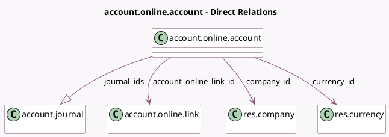

<!-- GENERATED:MODEL -->
---
tags: [odoo, enterprise, generated, model]
---

# account.online.account

- Module: [[docs/Enterprise Addons/account_online_synchronization/account_online_synchronization|account_online_synchronization]]
- Scope: Enterprise Addons
- Defined in module: yes
- Source files: `models/account_online.py`
- Python classes: `AccountOnlineAccount`
- Description: representation of an online bank account

## Field footprint

- Detected fields: 14
- Field types: `Boolean` x 2, `Char` x 4, `Date` x 1, `Float` x 2, `Many2one` x 3, `One2many` x 1, `Selection` x 1
- Relation fields: 4

## Sample fields

- `account_data`: `Char`
- `account_number`: `Char`
- `account_online_link_id`: `Many2one` (comodel `account.online.link`)
- `available_balance`: `Float`
- `balance`: `Float`
- `company_id`: `Many2one` (comodel `res.company`, related `account_online_link_id.company_id`)
- `currency_id`: `Many2one` (comodel `res.currency`)
- `fetching_status`: `Selection`
- `inverse_balance_sign`: `Boolean`
- `inverse_transaction_sign`: `Boolean`
- `journal_ids`: `One2many` (comodel `account.journal`)
- `last_sync`: `Date` (comodel `Last Transaction Synchronized on`)
- `name`: `Char`
- `online_identifier`: `Char`

## Method hints

- Detected methods: 11
- Action methods: `action_reset_fetching_status`
- Compute methods: none
- Onchange methods: none

## Direct relation diagram

## Navigation

- **Parent:** [[docs/Enterprise Addons/account_online_synchronization/Models]]

<!-- GENERATED:MODEL -->
