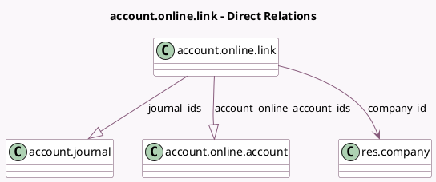

<!-- GENERATED:MODEL -->
---
tags: [odoo, enterprise, generated, model]
---

# account.online.link

- Module: [[docs/Enterprise Addons/account_online_synchronization/account_online_synchronization|account_online_synchronization]]
- Scope: Enterprise Addons
- Defined in module: yes
- Source files: `models/account_online.py`
- Python classes: `AccountOnlineLink`
- Description: Bank Connection
- Inherits: `mail.activity.mixin`, `mail.thread`

## Field footprint

- Detected fields: 17
- Field types: `Boolean` x 3, `Char` x 6, `Date` x 1, `Datetime` x 2, `Json` x 1, `Many2one` x 1, `One2many` x 2, `Selection` x 1
- Relation fields: 3

## Sample fields

- `access_token`: `Char`
- `account_online_account_ids`: `One2many` (comodel `account.online.account`)
- `auto_sync`: `Boolean`
- `client_id`: `Char`
- `company_id`: `Many2one` (comodel `res.company`)
- `connection_state_details`: `Json`
- `expiring_synchronization_date`: `Date`
- `has_unlinked_accounts`: `Boolean`
- `journal_ids`: `One2many` (comodel `account.journal`, compute `_compute_journal_ids`)
- `last_refresh`: `Datetime`
- `name`: `Char`
- `next_refresh`: `Datetime` (comodel `Next synchronization`, compute `_compute_next_synchronization`)
- `provider_type`: `Char`
- `refresh_token`: `Char`
- `renewal_contact_email`: `Char`
- `show_sync_actions`: `Boolean` (compute `_compute_show_sync_actions`)
- `state`: `Selection`

## Method hints

- Detected methods: 38
- Action methods: `action_fetch_transactions`, `action_new_synchronization`, `action_reconnect_account`, `action_update_credentials`
- Compute methods: `_compute_journal_ids`, `_compute_next_synchronization`, `_compute_show_sync_actions`
- Onchange methods: none

## Direct relation diagram

## Navigation

- **Parent:** [[docs/Enterprise Addons/account_online_synchronization/Models]]

<!-- GENERATED:MODEL -->
