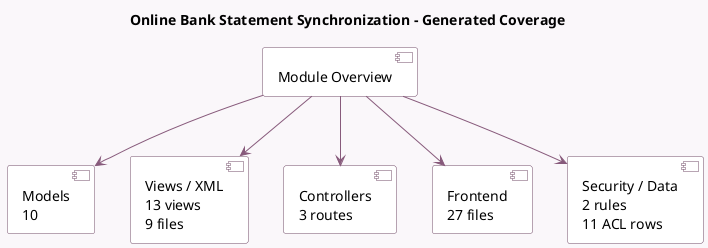

<!-- GENERATED:MODULE -->
---
tags: [odoo, enterprise, module]
---

# Online Bank Statement Synchronization

- Scope: Enterprise Addons
- Source: enterprise/account_online_synchronization
- Dependencies: [[docs/Enterprise Addons/account_accountant/account_accountant|account_accountant]]

## Summary

This module is used for Online bank synchronization.

## Generated coverage

- Models: 10
- XML files with UI/data artifacts: 9
- Views: 13
- Actions: 1
- Menus: 1
- Rules (ir.rule): 2
- Access CSV entries: 11
- Controller units: 2
- Frontend asset files: 27

## Module map

## Detail notes

- Models: [[docs/Enterprise Addons/account_online_synchronization/Models|Models]] (10)
- Views and XML: [[docs/Enterprise Addons/account_online_synchronization/Views|Views]] (9 files)
- Controllers: [[docs/Enterprise Addons/account_online_synchronization/Controllers|Controllers]] (2)
- Frontend: [[docs/Enterprise Addons/account_online_synchronization/Frontend|Frontend]] (27 files)

## Key models

- `account.bank.selection`
- `account.bank.statement.line`
- `account.bank.statement.line.transient`
- `account.duplicate.transaction.wizard`
- `account.journal`
- `account.missing.transaction.wizard`
- `account.online.account`
- `account.online.link`
- `res.company`
- `res.partner`

## Navigation

- [[../Enterprise Addons/Enterprise Addons|Back to scope]]
- [[../../docs/docs|Back to docs]]

<!-- GENERATED:MODULE -->

