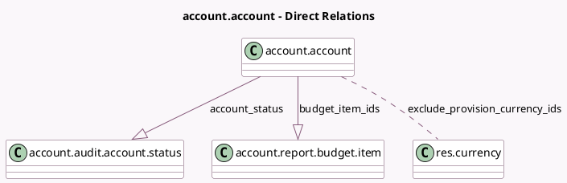

<!-- GENERATED:MODEL -->
---
tags: [odoo, enterprise, generated, model]
---

# account.account

- Module: [[docs/Enterprise Addons/account_reports/account_reports|account_reports]]
- Scope: Enterprise Addons
- Defined in module: extension only
- Source files: `models/account.py`
- Python classes: `AccountAccount`

## Field footprint

- Detected fields: 13
- Field types: `Boolean` x 2, `Char` x 1, `Float` x 1, `Many2many` x 1, `Monetary` x 5, `One2many` x 2, `Selection` x 1
- Relation fields: 3

## Sample fields

- `account_status`: `One2many` (comodel `account.audit.account.status`)
- `audit_balance`: `Monetary` (compute `_compute_audit_period`)
- `audit_balance_show_warning`: `Boolean` (compute `_compute_audit_balance_show_warning`)
- `audit_credit`: `Monetary` (compute `_compute_audit_period`)
- `audit_debit`: `Monetary` (compute `_compute_audit_period`)
- `audit_previous_balance`: `Monetary` (compute `_compute_audit_period`)
- `audit_previous_balance_show_warning`: `Boolean` (compute `_compute_audit_previous_balance_show_warning`)
- `audit_status`: `Selection` (compute `_compute_audit_status`)
- `audit_var_n_1`: `Monetary` (compute `_compute_audit_variation`)
- `audit_var_percentage`: `Float` (compute `_compute_audit_variation`)
- `budget_item_ids`: `One2many` (comodel `account.report.budget.item`)
- `exclude_provision_currency_ids`: `Many2many` (comodel `res.currency`)
- `last_message`: `Char` (compute `_compute_last_message`)

## Method hints

- Detected methods: 17
- Action methods: `action_audit_account`
- Compute methods: `_compute_audit_balance_show_warning`, `_compute_audit_period`, `_compute_audit_previous_balance_show_warning`, `_compute_audit_status`, `_compute_audit_variation`, `_compute_balance_warning`, `_compute_last_message`
- Onchange methods: none

## Direct relation diagram

## Navigation

- **Parent:** [[docs/Enterprise Addons/account_reports/Models]]

<!-- GENERATED:MODEL -->
