<!-- GENERATED:MODEL -->
---
tags: [odoo, enterprise, generated, model]
---

# account.financial.year.op

- Module: [[docs/Enterprise Addons/account_reports/account_reports|account_reports]]
- Scope: Enterprise Addons
- Defined in module: extension only
- Source files: `wizard/fiscal_year.py`
- Python classes: `AccountFinancialYearOp`
- Description: Opening Balance of Financial Year

## Field footprint

- Detected fields: 4
- Field types: `Char` x 1, `Integer` x 1, `Many2one` x 1, `Selection` x 1
- Relation fields: 1

## Sample fields

- `account_return_periodicity`: `Selection` (related `company_id.account_return_periodicity`)
- `account_return_reminder_day`: `Integer` (related `company_id.account_return_reminder_day`)
- `account_tax_return_journal_id`: `Many2one` (related `company_id.account_tax_return_journal_id`)
- `vat_label`: `Char` (related `company_id.country_id.vat_label`)

## Method hints

- Detected methods: 2
- Action methods: `action_save_onboarding_fiscal_year`
- Compute methods: none
- Onchange methods: none

## Direct relation diagram

```plantuml
@startuml
!define ODOO_COLOR_PRIMARY #714B67
!define ODOO_COLOR_ACCENT #875A7B
!define ODOO_COLOR_BG #FAF7FA

skinparam backgroundColor ODOO_COLOR_BG
skinparam defaultTextAlignment left
skinparam ArrowColor ODOO_COLOR_ACCENT
skinparam ClassBackgroundColor white
skinparam ClassBorderColor ODOO_COLOR_PRIMARY
skinparam ComponentBackgroundColor white
skinparam ComponentBorderColor ODOO_COLOR_PRIMARY
skinparam NoteBackgroundColor #FFF8FF
skinparam NoteBorderColor ODOO_COLOR_ACCENT
skinparam SequenceLifeLineBorderColor ODOO_COLOR_ACCENT
skinparam SequenceLifeLineBackgroundColor #FFFFFF
skinparam SequenceParticipantBorderColor ODOO_COLOR_PRIMARY
skinparam SequenceParticipantBackgroundColor #FFFFFF
skinparam sequence {
  ArrowColor ODOO_COLOR_ACCENT
  ActorBorderColor ODOO_COLOR_PRIMARY
}
title account.financial.year.op - Direct Relations
class "account.financial.year.op" as account_financial_year_op
@enduml
```

## Navigation

- **Parent:** [[docs/Enterprise Addons/account_reports/Models]]

<!-- GENERATED:MODEL -->
