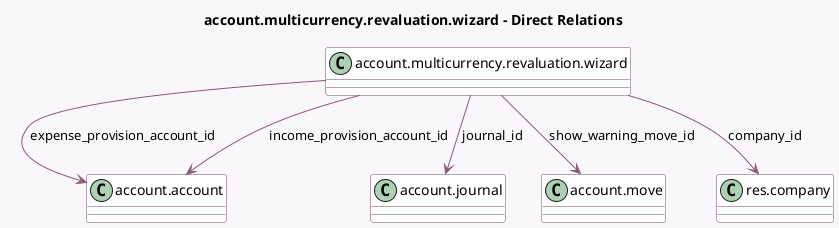

<!-- GENERATED:MODEL -->
---
tags: [odoo, enterprise, generated, model]
---

# account.multicurrency.revaluation.wizard

- Module: [[docs/Enterprise Addons/account_reports/account_reports|account_reports]]
- Scope: Enterprise Addons
- Defined in module: yes
- Source files: `wizard/multicurrency_revaluation.py`
- Python classes: `AccountMulticurrencyRevaluationWizard`
- Description: Multicurrency Revaluation Wizard

## Field footprint

- Detected fields: 8
- Field types: `Date` x 2, `Many2one` x 5, `Text` x 1
- Relation fields: 5

## Sample fields

- `company_id`: `Many2one` (comodel `res.company`)
- `date`: `Date`
- `expense_provision_account_id`: `Many2one` (comodel `account.account`, compute `_compute_accounting_values`)
- `income_provision_account_id`: `Many2one` (comodel `account.account`, compute `_compute_accounting_values`)
- `journal_id`: `Many2one` (comodel `account.journal`, compute `_compute_accounting_values`)
- `preview_data`: `Text` (compute `_compute_preview_data`)
- `reversal_date`: `Date`
- `show_warning_move_id`: `Many2one` (comodel `account.move`, compute `_compute_show_warning`)

## Method hints

- Detected methods: 9
- Action methods: none
- Compute methods: `_compute_accounting_values`, `_compute_preview_data`, `_compute_show_warning`
- Onchange methods: none

## Direct relation diagram

## Navigation

- **Parent:** [[docs/Enterprise Addons/account_reports/Models]]

<!-- GENERATED:MODEL -->
