<!-- GENERATED:MODEL -->
---
tags: [odoo, enterprise, generated, model]
---

# account.report.annotation

- Module: [[docs/Enterprise Addons/account_reports/account_reports|account_reports]]
- Scope: Enterprise Addons
- Defined in module: yes
- Source files: `models/account_report.py`
- Python classes: `AccountReportAnnotation`
- Description: Account Report Annotation

## Field footprint

- Detected fields: 2
- Field types: `Date` x 1, `Many2one` x 1
- Relation fields: 1

## Sample fields

- `date`: `Date`
- `message_id`: `Many2one` (comodel `mail.message`)

## Method hints

- Detected methods: 0
- Action methods: none
- Compute methods: none
- Onchange methods: none

## Direct relation diagram

```plantuml
@startuml
!define ODOO_COLOR_PRIMARY #714B67
!define ODOO_COLOR_ACCENT #875A7B
!define ODOO_COLOR_BG #FAF7FA

skinparam backgroundColor ODOO_COLOR_BG
skinparam defaultTextAlignment left
skinparam ArrowColor ODOO_COLOR_ACCENT
skinparam ClassBackgroundColor white
skinparam ClassBorderColor ODOO_COLOR_PRIMARY
skinparam ComponentBackgroundColor white
skinparam ComponentBorderColor ODOO_COLOR_PRIMARY
skinparam NoteBackgroundColor #FFF8FF
skinparam NoteBorderColor ODOO_COLOR_ACCENT
skinparam SequenceLifeLineBorderColor ODOO_COLOR_ACCENT
skinparam SequenceLifeLineBackgroundColor #FFFFFF
skinparam SequenceParticipantBorderColor ODOO_COLOR_PRIMARY
skinparam SequenceParticipantBackgroundColor #FFFFFF
skinparam sequence {
  ArrowColor ODOO_COLOR_ACCENT
  ActorBorderColor ODOO_COLOR_PRIMARY
}
title account.report.annotation - Direct Relations
class "account.report.annotation" as account_report_annotation
class "mail.message" as mail_message
account_report_annotation --> mail_message : message_id
@enduml
```

## Navigation

- **Parent:** [[docs/Enterprise Addons/account_reports/Models]]

<!-- GENERATED:MODEL -->
