<!-- GENERATED:MODEL -->
---
tags: [odoo, enterprise, generated, model]
---

# account.report.horizontal.group

- Module: [[docs/Enterprise Addons/account_reports/account_reports|account_reports]]
- Scope: Enterprise Addons
- Defined in module: yes
- Source files: `models/account_report.py`
- Python classes: `AccountReportHorizontalGroup`
- Description: Horizontal group for reports

## Field footprint

- Detected fields: 3
- Field types: `Char` x 1, `Many2many` x 1, `One2many` x 1
- Relation fields: 2

## Sample fields

- `name`: `Char`
- `report_ids`: `Many2many` (comodel `account.report`)
- `rule_ids`: `One2many` (comodel `account.report.horizontal.group.rule`)

## Method hints

- Detected methods: 1
- Action methods: none
- Compute methods: none
- Onchange methods: none

## Direct relation diagram

```plantuml
@startuml
!define ODOO_COLOR_PRIMARY #714B67
!define ODOO_COLOR_ACCENT #875A7B
!define ODOO_COLOR_BG #FAF7FA

skinparam backgroundColor ODOO_COLOR_BG
skinparam defaultTextAlignment left
skinparam ArrowColor ODOO_COLOR_ACCENT
skinparam ClassBackgroundColor white
skinparam ClassBorderColor ODOO_COLOR_PRIMARY
skinparam ComponentBackgroundColor white
skinparam ComponentBorderColor ODOO_COLOR_PRIMARY
skinparam NoteBackgroundColor #FFF8FF
skinparam NoteBorderColor ODOO_COLOR_ACCENT
skinparam SequenceLifeLineBorderColor ODOO_COLOR_ACCENT
skinparam SequenceLifeLineBackgroundColor #FFFFFF
skinparam SequenceParticipantBorderColor ODOO_COLOR_PRIMARY
skinparam SequenceParticipantBackgroundColor #FFFFFF
skinparam sequence {
  ArrowColor ODOO_COLOR_ACCENT
  ActorBorderColor ODOO_COLOR_PRIMARY
}
title account.report.horizontal.group - Direct Relations
class "account.report.horizontal.group" as account_report_horizontal_group
class "account.report" as account_report
class "account.report.horizontal.group.rule" as account_report_horizontal_group_rule
account_report_horizontal_group --|> account_report_horizontal_group_rule : rule_ids
account_report_horizontal_group .. account_report : report_ids
@enduml
```

## Navigation

- **Parent:** [[docs/Enterprise Addons/account_reports/Models]]

<!-- GENERATED:MODEL -->
