<!-- GENERATED:MODEL -->
---
tags: [odoo, enterprise, generated, model]
---

# account.report.horizontal.group.rule

- Module: [[docs/Enterprise Addons/account_reports/account_reports|account_reports]]
- Scope: Enterprise Addons
- Defined in module: yes
- Source files: `models/account_report.py`
- Python classes: `AccountReportHorizontalGroupRule`
- Description: Horizontal group rule for reports

## Field footprint

- Detected fields: 4
- Field types: `Char` x 2, `Many2one` x 1, `Selection` x 1
- Relation fields: 1

## Sample fields

- `domain`: `Char`
- `field_name`: `Selection`
- `horizontal_group_id`: `Many2one` (comodel `account.report.horizontal.group`)
- `res_model_name`: `Char` (compute `_compute_res_model_name`)

## Method hints

- Detected methods: 3
- Action methods: none
- Compute methods: `_compute_res_model_name`
- Onchange methods: none

## Direct relation diagram

```plantuml
@startuml
!define ODOO_COLOR_PRIMARY #714B67
!define ODOO_COLOR_ACCENT #875A7B
!define ODOO_COLOR_BG #FAF7FA

skinparam backgroundColor ODOO_COLOR_BG
skinparam defaultTextAlignment left
skinparam ArrowColor ODOO_COLOR_ACCENT
skinparam ClassBackgroundColor white
skinparam ClassBorderColor ODOO_COLOR_PRIMARY
skinparam ComponentBackgroundColor white
skinparam ComponentBorderColor ODOO_COLOR_PRIMARY
skinparam NoteBackgroundColor #FFF8FF
skinparam NoteBorderColor ODOO_COLOR_ACCENT
skinparam SequenceLifeLineBorderColor ODOO_COLOR_ACCENT
skinparam SequenceLifeLineBackgroundColor #FFFFFF
skinparam SequenceParticipantBorderColor ODOO_COLOR_PRIMARY
skinparam SequenceParticipantBackgroundColor #FFFFFF
skinparam sequence {
  ArrowColor ODOO_COLOR_ACCENT
  ActorBorderColor ODOO_COLOR_PRIMARY
}
title account.report.horizontal.group.rule - Direct Relations
class "account.report.horizontal.group.rule" as account_report_horizontal_group_rule
class "account.report.horizontal.group" as account_report_horizontal_group
account_report_horizontal_group_rule --> account_report_horizontal_group : horizontal_group_id
@enduml
```

## Navigation

- **Parent:** [[docs/Enterprise Addons/account_reports/Models]]

<!-- GENERATED:MODEL -->
