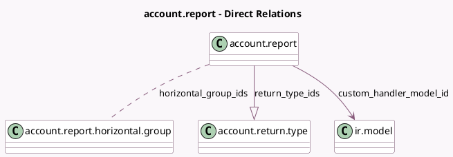

<!-- GENERATED:MODEL -->
---
tags: [odoo, enterprise, generated, model]
---

# account.report

- Module: [[docs/Enterprise Addons/account_reports/account_reports|account_reports]]
- Scope: Enterprise Addons
- Defined in module: extension only
- Source files: `models/account_analytic_report.py`, `models/account_report.py`, `models/executive_summary_report.py`
- Python classes: `AccountReport`

## Field footprint

- Detected fields: 8
- Field types: `Boolean` x 3, `Char` x 1, `Json` x 1, `Many2many` x 1, `Many2one` x 1, `One2many` x 1
- Relation fields: 3

## Sample fields

- `allow_account_audit_status_on_lines`: `Boolean` (store `True`)
- `custom_handler_model_id`: `Many2one` (comodel `ir.model`)
- `custom_handler_model_name`: `Char` (related `custom_handler_model_id.model`)
- `filter_analytic_groupby`: `Boolean` (store `True`)
- `horizontal_group_ids`: `Many2many` (comodel `account.report.horizontal.group`)
- `is_account_coverage_report_available`: `Boolean` (compute `_compute_is_account_coverage_report_available`)
- `return_type_ids`: `One2many` (comodel `account.return.type`)
- `send_and_print_values`: `Json`

## Method hints

- Detected methods: 222
- Action methods: `action_audit_cell`, `action_create_composite_report`, `action_display_inactive_sections`, `action_download_xlsx_accounts_coverage_report`, `action_modify_manual_value`, `action_open_report_form`, `action_open_returns`, `action_view_all_variants`
- Compute methods: `_compute_column_percent_comparison_data`, `_compute_expression_totals_for_each_column_group`, `_compute_expression_totals_for_single_column_group`, `_compute_formula_batch`, `_compute_formula_batch_with_engine_account_codes`, `_compute_formula_batch_with_engine_custom`, `_compute_formula_batch_with_engine_domain`, `_compute_formula_batch_with_engine_external`, and 3 more
- Onchange methods: none

## Direct relation diagram

## Navigation

- **Parent:** [[docs/Enterprise Addons/account_reports/Models]]

<!-- GENERATED:MODEL -->
