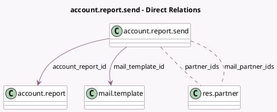

<!-- GENERATED:MODEL -->
---
tags: [odoo, enterprise, generated, model]
---

# account.report.send

- Module: [[docs/Enterprise Addons/account_reports/account_reports|account_reports]]
- Scope: Enterprise Addons
- Defined in module: yes
- Source files: `wizard/account_report_send.py`
- Python classes: `AccountReportSend`
- Description: Account Report Send

## Field footprint

- Detected fields: 17
- Field types: `Boolean` x 6, `Char` x 2, `Html` x 1, `Json` x 3, `Many2many` x 2, `Many2one` x 2, `Selection` x 1
- Relation fields: 4

## Sample fields

- `account_report_id`: `Many2one` (comodel `account.report`)
- `checkbox_download`: `Boolean`
- `checkbox_send_mail`: `Boolean`
- `display_mail_composer`: `Boolean` (compute `_compute_send_mail_extra_fields`)
- `enable_download`: `Boolean`
- `enable_send_mail`: `Boolean`
- `mail_attachments_widget`: `Json` (compute `_compute_mail_attachments_widget`, store `True`)
- `mail_body`: `Html` (compute `_compute_mail_subject_body`, store `True`)
- `mail_lang`: `Char` (compute `_compute_mail_lang`)
- `mail_partner_ids`: `Many2many` (comodel `res.partner`, compute `_compute_mail_partner_ids`, store `True`)
- `mail_subject`: `Char` (compute `_compute_mail_subject_body`, store `True`)
- `mail_template_id`: `Many2one` (comodel `mail.template`)
- `mode`: `Selection` (compute `_compute_mode`, store `True`)
- `partner_ids`: `Many2many` (comodel `res.partner`, compute `_compute_partner_ids`)
- `report_options`: `Json`
- `send_mail_readonly`: `Boolean` (compute `_compute_send_mail_extra_fields`)
- `warnings`: `Json` (compute `_compute_warnings`)

## Method hints

- Detected methods: 17
- Action methods: `action_send_and_print`
- Compute methods: `_compute_mail_attachments_widget`, `_compute_mail_lang`, `_compute_mail_partner_ids`, `_compute_mail_subject_body`, `_compute_mode`, `_compute_partner_ids`, `_compute_send_mail_extra_fields`, `_compute_warnings`
- Onchange methods: none

## Direct relation diagram

## Navigation

- **Parent:** [[docs/Enterprise Addons/account_reports/Models]]

<!-- GENERATED:MODEL -->
