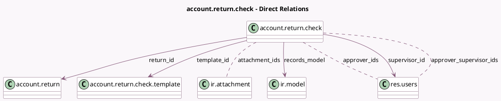

<!-- GENERATED:MODEL -->
---
tags: [odoo, enterprise, generated, model]
---

# account.return.check

- Module: [[docs/Enterprise Addons/account_reports/account_reports|account_reports]]
- Scope: Enterprise Addons
- Defined in module: yes
- Source files: `models/account_return.py`
- Python classes: `AccountReturnCheck`
- Description: Accounting Return Check

## Field footprint

- Detected fields: 22
- Field types: `Boolean` x 2, `Char` x 6, `Date` x 1, `Integer` x 1, `Json` x 1, `Many2many` x 3, `Many2one` x 4, `Selection` x 3, `Text` x 1
- Relation fields: 7

## Sample fields

- `action`: `Json`
- `approver_ids`: `Many2many` (comodel `res.users`)
- `approver_supervisor_ids`: `Many2many` (comodel `res.users`, compute `_compute_approver_supervisor_ids`)
- `attachment_ids`: `Many2many` (comodel `ir.attachment`)
- `code`: `Char`
- `cycle`: `Selection` (related `template_id.cycle`)
- `date_deadline`: `Date` (comodel `Deadline`, related `return_id.date_deadline`)
- `is_return_active`: `Boolean` (related `return_id.active`)
- `message`: `Text`
- `name`: `Char`
- `records_count`: `Integer`
- `records_model`: `Many2one` (comodel `ir.model`)
- `records_name`: `Char` (compute `_compute_records_name`)
- `refresh_result`: `Boolean`
- `result`: `Selection`
- `return_id`: `Many2one` (comodel `account.return`)
- `return_name`: `Char` (related `return_id.name`)
- `return_state`: `Char` (related `return_id.state`, store `True`)
- `state`: `Char`
- `supervisor_id`: `Many2one` (comodel `res.users`)

## Method hints

- Detected methods: 10
- Action methods: `action_open_document`, `action_review`, `action_unlink_attachments`
- Compute methods: `_compute_approver_supervisor_ids`, `_compute_records_name`
- Onchange methods: none

## Direct relation diagram

## Navigation

- **Parent:** [[docs/Enterprise Addons/account_reports/Models]]

<!-- GENERATED:MODEL -->
