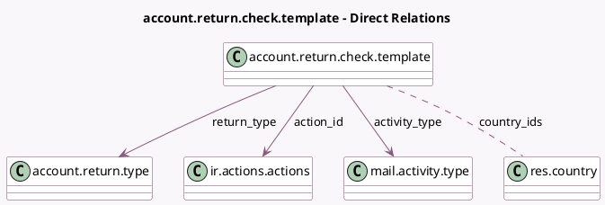

<!-- GENERATED:MODEL -->
---
tags: [odoo, enterprise, generated, model]
---

# account.return.check.template

- Module: [[docs/Enterprise Addons/account_reports/account_reports|account_reports]]
- Scope: Enterprise Addons
- Defined in module: yes
- Source files: `models/account_return.py`
- Python classes: `AccountReturnCheckTemplate`
- Description: Account Return Check Template

## Field footprint

- Detected fields: 14
- Field types: `Char` x 6, `Many2many` x 1, `Many2one` x 3, `Selection` x 3, `Text` x 1
- Relation fields: 4

## Sample fields

- `action_id`: `Many2one` (comodel `ir.actions.actions`)
- `activity_type`: `Many2one` (comodel `mail.activity.type`)
- `additional_action_context`: `Char`
- `additional_action_domain`: `Char`
- `additional_action_params`: `Char`
- `code`: `Char`
- `country_ids`: `Many2many` (comodel `res.country`)
- `cycle`: `Selection`
- `description`: `Text`
- `domain`: `Char`
- `model`: `Selection`
- `name`: `Char`
- `return_type`: `Many2one` (comodel `account.return.type`)
- `type`: `Selection`

## Method hints

- Detected methods: 1
- Action methods: none
- Compute methods: none
- Onchange methods: none

## Direct relation diagram

## Navigation

- **Parent:** [[docs/Enterprise Addons/account_reports/Models]]

<!-- GENERATED:MODEL -->
