<!-- GENERATED:MODEL -->
---
tags: [odoo, enterprise, generated, model]
---

# account.return.creation.wizard

- Module: [[docs/Enterprise Addons/account_reports/account_reports|account_reports]]
- Scope: Enterprise Addons
- Defined in module: yes
- Source files: `wizard/return_creation_wizard.py`
- Python classes: `AccountReturnCreationWizard`
- Description: Return creation wizard

## Field footprint

- Detected fields: 19
- Field types: `Boolean` x 13, `Date` x 2, `Many2many` x 1, `Many2one` x 2, `Selection` x 1
- Relation fields: 3

## Sample fields

- `available_return_type_ids`: `Many2many` (comodel `account.return.type`, compute `_compute_available_return_type`)
- `category`: `Selection`
- `company_id`: `Many2one` (comodel `res.company`)
- `date_from`: `Date`
- `date_to`: `Date`
- `equity`: `Boolean`
- `fixed_assets`: `Boolean`
- `government`: `Boolean`
- `inventory`: `Boolean`
- `operating_expenses`: `Boolean`
- `other`: `Boolean`
- `payroll`: `Boolean`
- `purchases`: `Boolean`
- `regulatory_compliance`: `Boolean`
- `return_type_id`: `Many2one` (comodel `account.return.type`, compute `_compute_return_type_id`, store `True`)
- `sales`: `Boolean`
- `show_warning_existing_return`: `Boolean` (compute `_compute_warnings`)
- `show_warning_wrong_dates`: `Boolean` (compute `_compute_warnings`)
- `treasury_financing`: `Boolean`

## Method hints

- Detected methods: 5
- Action methods: `action_create_manual_account_returns`
- Compute methods: `_compute_available_return_type`, `_compute_return_type_id`, `_compute_warnings`
- Onchange methods: `_onchange_return_type_id`

## Direct relation diagram

```plantuml
@startuml
!define ODOO_COLOR_PRIMARY #714B67
!define ODOO_COLOR_ACCENT #875A7B
!define ODOO_COLOR_BG #FAF7FA

skinparam backgroundColor ODOO_COLOR_BG
skinparam defaultTextAlignment left
skinparam ArrowColor ODOO_COLOR_ACCENT
skinparam ClassBackgroundColor white
skinparam ClassBorderColor ODOO_COLOR_PRIMARY
skinparam ComponentBackgroundColor white
skinparam ComponentBorderColor ODOO_COLOR_PRIMARY
skinparam NoteBackgroundColor #FFF8FF
skinparam NoteBorderColor ODOO_COLOR_ACCENT
skinparam SequenceLifeLineBorderColor ODOO_COLOR_ACCENT
skinparam SequenceLifeLineBackgroundColor #FFFFFF
skinparam SequenceParticipantBorderColor ODOO_COLOR_PRIMARY
skinparam SequenceParticipantBackgroundColor #FFFFFF
skinparam sequence {
  ArrowColor ODOO_COLOR_ACCENT
  ActorBorderColor ODOO_COLOR_PRIMARY
}
title account.return.creation.wizard - Direct Relations
class "account.return.creation.wizard" as account_return_creation_wizard
class "account.return.type" as account_return_type
class "res.company" as res_company
account_return_creation_wizard --> res_company : company_id
account_return_creation_wizard .. account_return_type : available_return_type_ids
account_return_creation_wizard --> account_return_type : return_type_id
@enduml
```

## Navigation

- **Parent:** [[docs/Enterprise Addons/account_reports/Models]]

<!-- GENERATED:MODEL -->
