<!-- GENERATED:MODEL -->
---
tags: [odoo, enterprise, generated, model]
---

# account.return

- Module: [[docs/Enterprise Addons/account_reports/account_reports|account_reports]]
- Scope: Enterprise Addons
- Defined in module: yes
- Source files: `models/account_return.py`
- Python classes: `AccountReturn`
- Description: Accounting Return
- Inherits: `mail.activity.mixin`, `mail.thread.main.attachment`

## Field footprint

- Detected fields: 47
- Field types: `Boolean` x 12, `Char` x 6, `Date` x 5, `Integer` x 6, `Json` x 1, `Many2many` x 2, `Many2one` x 4, `Monetary` x 2, `One2many` x 3, `Selection` x 6
- Relation fields: 9

## Sample fields

- `active`: `Boolean`
- `amount_to_pay_currency_id`: `Many2one` (comodel `res.currency`, compute `_compute_amount_to_pay_currency_id`)
- `attachment_ids`: `Many2many` (comodel `ir.attachment`)
- `audit_account_status_ids`: `One2many` (comodel `account.audit.account.status`)
- `audit_balances_completed_count`: `Integer` (compute `_compute_audit_balances_completed_count`)
- `audit_balances_count`: `Integer` (compute `_compute_audit_balances_count`)
- `audit_status`: `Selection`
- `check_count`: `Integer` (compute `_compute_check_count`)
- `check_ids`: `One2many` (comodel `account.return.check`)
- `closing_move_ids`: `One2many` (comodel `account.move`)
- `company_id`: `Many2one` (comodel `res.company`)
- `company_ids`: `Many2many` (comodel `res.company`, compute `_compute_company_ids`, store `True`)
- `date_deadline`: `Date` (compute `_compute_deadline`, store `True`)
- `date_from`: `Date`
- `date_lock`: `Date`
- `date_submission`: `Date`
- `date_to`: `Date`
- `days_to_deadline`: `Integer` (compute `_compute_days_to_deadline`)
- `generic_state_only_pay`: `Selection`
- `generic_state_review`: `Selection`

## Method hints

- Detected methods: 88
- Action methods: `action_archive`, `action_delete`, `action_export_working_files`, `action_mark_completed`, `action_mark_uncompleted`, `action_open_account_return`, `action_open_attachments`, `action_open_audit_balances`, and 13 more
- Compute methods: `_compute_amount_to_pay_currency_id`, `_compute_audit_balances_completed_count`, `_compute_audit_balances_count`, `_compute_check_count`, `_compute_company_ids`, `_compute_days_to_deadline`, `_compute_deadline`, `_compute_has_move_entries`, and 12 more
- Onchange methods: none

## Direct relation diagram

```plantuml
@startuml
!define ODOO_COLOR_PRIMARY #714B67
!define ODOO_COLOR_ACCENT #875A7B
!define ODOO_COLOR_BG #FAF7FA

skinparam backgroundColor ODOO_COLOR_BG
skinparam defaultTextAlignment left
skinparam ArrowColor ODOO_COLOR_ACCENT
skinparam ClassBackgroundColor white
skinparam ClassBorderColor ODOO_COLOR_PRIMARY
skinparam ComponentBackgroundColor white
skinparam ComponentBorderColor ODOO_COLOR_PRIMARY
skinparam NoteBackgroundColor #FFF8FF
skinparam NoteBorderColor ODOO_COLOR_ACCENT
skinparam SequenceLifeLineBorderColor ODOO_COLOR_ACCENT
skinparam SequenceLifeLineBackgroundColor #FFFFFF
skinparam SequenceParticipantBorderColor ODOO_COLOR_PRIMARY
skinparam SequenceParticipantBackgroundColor #FFFFFF
skinparam sequence {
  ArrowColor ODOO_COLOR_ACCENT
  ActorBorderColor ODOO_COLOR_PRIMARY
}
title account.return - Direct Relations
class "account.return" as account_return
class "account.audit.account.status" as account_audit_account_status
class "account.move" as account_move
class "account.return.check" as account_return_check
class "account.return.type" as account_return_type
class "account.tax.unit" as account_tax_unit
class "ir.attachment" as ir_attachment
class "res.company" as res_company
class "res.currency" as res_currency
account_return --> account_return_type : type_id
account_return --> res_company : company_id
account_return --> account_tax_unit : tax_unit_id
account_return .. res_company : company_ids
account_return --|> account_move : closing_move_ids
account_return .. ir_attachment : attachment_ids
account_return --|> account_return_check : check_ids
account_return --> res_currency : amount_to_pay_currency_id
account_return --|> account_audit_account_status : audit_account_status_ids
@enduml
```

## Navigation

- **Parent:** [[docs/Enterprise Addons/account_reports/Models]]

<!-- GENERATED:MODEL -->
