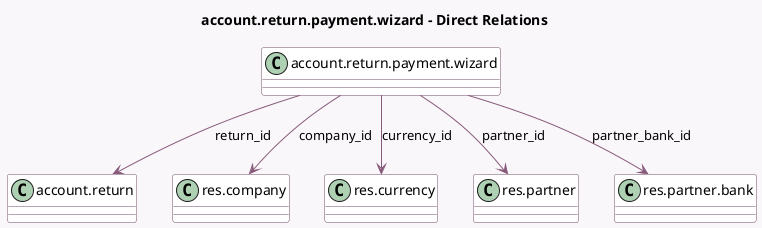

<!-- GENERATED:MODEL -->
---
tags: [odoo, enterprise, generated, model]
---

# account.return.payment.wizard

- Module: [[docs/Enterprise Addons/account_reports/account_reports|account_reports]]
- Scope: Enterprise Addons
- Defined in module: yes
- Source files: `wizard/return_generic_payment_wizard.py`
- Python classes: `AccountReturnGenericPaymentWizard`
- Description: Returns Generic Payment Wizard

## Field footprint

- Detected fields: 9
- Field types: `Boolean` x 1, `Char` x 2, `Many2one` x 5, `Monetary` x 1
- Relation fields: 5

## Sample fields

- `acc_number`: `Char` (related `partner_bank_id.acc_number`)
- `amount_to_pay`: `Monetary` (compute `_compute_amount_to_pay`, store `True`)
- `communication`: `Char` (compute `_compute_communication`)
- `company_id`: `Many2one` (comodel `res.company`)
- `currency_id`: `Many2one` (comodel `res.currency`, related `return_id.amount_to_pay_currency_id`)
- `is_recoverable`: `Boolean` (compute `_compute_is_recoverable`)
- `partner_bank_id`: `Many2one` (comodel `res.partner.bank`)
- `partner_id`: `Many2one` (comodel `res.partner`, related `partner_bank_id.partner_id`)
- `return_id`: `Many2one` (comodel `account.return`)

## Method hints

- Detected methods: 6
- Action methods: `action_mark_as_paid`, `action_send_email_instructions`
- Compute methods: `_compute_amount_to_pay`, `_compute_communication`, `_compute_is_recoverable`
- Onchange methods: none

## Direct relation diagram

## Navigation

- **Parent:** [[docs/Enterprise Addons/account_reports/Models]]

<!-- GENERATED:MODEL -->
