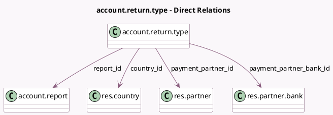

<!-- GENERATED:MODEL -->
---
tags: [odoo, enterprise, generated, model]
---

# account.return.type

- Module: [[docs/Enterprise Addons/account_reports/account_reports|account_reports]]
- Scope: Enterprise Addons
- Defined in module: yes
- Source files: `models/account_return.py`
- Python classes: `AccountReturnType`
- Description: Accounting Return Type
- Inherits: `mail.thread`

## Field footprint

- Detected fields: 16
- Field types: `Boolean` x 3, `Char` x 1, `Date` x 2, `Integer` x 2, `Many2one` x 4, `Selection` x 4
- Relation fields: 4

## Sample fields

- `auto_generate`: `Boolean` (compute `_compute_auto_generate`, store `True`)
- `category`: `Selection`
- `country_id`: `Many2one` (comodel `res.country`, compute `_compute_country_id`, store `True`)
- `deadline_days_delay`: `Integer`
- `deadline_periodicity`: `Selection`
- `deadline_start_date`: `Date`
- `default_deadline_days_delay`: `Integer`
- `default_deadline_periodicity`: `Selection`
- `default_deadline_start_date`: `Date`
- `is_ec_sales_list_return_type`: `Boolean` (compute `_compute_report_return_type`)
- `is_tax_return_type`: `Boolean` (compute `_compute_report_return_type`)
- `name`: `Char`
- `payment_partner_bank_id`: `Many2one` (comodel `res.partner.bank`)
- `payment_partner_id`: `Many2one` (comodel `res.partner`, related `payment_partner_bank_id.partner_id`)
- `report_id`: `Many2one` (comodel `account.report`)
- `states_workflow`: `Selection` (compute `_compute_states_workflow`, store `True`)

## Method hints

- Detected methods: 23
- Action methods: none
- Compute methods: `_compute_auto_generate`, `_compute_country_id`, `_compute_display_name`, `_compute_report_return_type`, `_compute_states_workflow`
- Onchange methods: `_onchange_category`

## Direct relation diagram

## Navigation

- **Parent:** [[docs/Enterprise Addons/account_reports/Models]]

<!-- GENERATED:MODEL -->
