<!-- GENERATED:MODEL -->
---
tags: [odoo, enterprise, generated, model]
---

# account.tax.unit

- Module: [[docs/Enterprise Addons/account_reports/account_reports|account_reports]]
- Scope: Enterprise Addons
- Defined in module: yes
- Source files: `models/account_tax.py`
- Python classes: `AccountTaxUnit`
- Description: Tax Unit

## Field footprint

- Detected fields: 6
- Field types: `Boolean` x 1, `Char` x 2, `Many2many` x 1, `Many2one` x 2
- Relation fields: 3

## Sample fields

- `company_ids`: `Many2many` (comodel `res.company`)
- `country_id`: `Many2one` (comodel `res.country`)
- `fpos_synced`: `Boolean` (compute `_compute_fiscal_position_completion`)
- `main_company_id`: `Many2one` (comodel `res.company`)
- `name`: `Char`
- `vat`: `Char`

## Method hints

- Detected methods: 12
- Action methods: `action_sync_unit_fiscal_positions`
- Compute methods: `_compute_fiscal_position_completion`
- Onchange methods: `_onchange_company_ids`, `_onchange_vat`

## Direct relation diagram

```plantuml
@startuml
!define ODOO_COLOR_PRIMARY #714B67
!define ODOO_COLOR_ACCENT #875A7B
!define ODOO_COLOR_BG #FAF7FA

skinparam backgroundColor ODOO_COLOR_BG
skinparam defaultTextAlignment left
skinparam ArrowColor ODOO_COLOR_ACCENT
skinparam ClassBackgroundColor white
skinparam ClassBorderColor ODOO_COLOR_PRIMARY
skinparam ComponentBackgroundColor white
skinparam ComponentBorderColor ODOO_COLOR_PRIMARY
skinparam NoteBackgroundColor #FFF8FF
skinparam NoteBorderColor ODOO_COLOR_ACCENT
skinparam SequenceLifeLineBorderColor ODOO_COLOR_ACCENT
skinparam SequenceLifeLineBackgroundColor #FFFFFF
skinparam SequenceParticipantBorderColor ODOO_COLOR_PRIMARY
skinparam SequenceParticipantBackgroundColor #FFFFFF
skinparam sequence {
  ArrowColor ODOO_COLOR_ACCENT
  ActorBorderColor ODOO_COLOR_PRIMARY
}
title account.tax.unit - Direct Relations
class "account.tax.unit" as account_tax_unit
class "res.company" as res_company
class "res.country" as res_country
account_tax_unit --> res_country : country_id
account_tax_unit .. res_company : company_ids
account_tax_unit --> res_company : main_company_id
@enduml
```

## Navigation

- **Parent:** [[docs/Enterprise Addons/account_reports/Models]]

<!-- GENERATED:MODEL -->
