<!-- GENERATED:MODEL -->
---
tags: [odoo, enterprise, generated, model]
---

# account_reports.export.wizard.format

- Module: [[docs/Enterprise Addons/account_reports/account_reports|account_reports]]
- Scope: Enterprise Addons
- Defined in module: yes
- Source files: `wizard/report_export_wizard.py`
- Python classes: `Account_ReportsExportWizardFormat`
- Description: Export format for accounting's reports

## Field footprint

- Detected fields: 4
- Field types: `Char` x 3, `Many2one` x 1
- Relation fields: 1

## Sample fields

- `export_wizard_id`: `Many2one` (comodel `account_reports.export.wizard`)
- `fun_param`: `Char`
- `fun_to_call`: `Char`
- `name`: `Char`

## Method hints

- Detected methods: 2
- Action methods: none
- Compute methods: none
- Onchange methods: none

## Direct relation diagram

```plantuml
@startuml
!define ODOO_COLOR_PRIMARY #714B67
!define ODOO_COLOR_ACCENT #875A7B
!define ODOO_COLOR_BG #FAF7FA

skinparam backgroundColor ODOO_COLOR_BG
skinparam defaultTextAlignment left
skinparam ArrowColor ODOO_COLOR_ACCENT
skinparam ClassBackgroundColor white
skinparam ClassBorderColor ODOO_COLOR_PRIMARY
skinparam ComponentBackgroundColor white
skinparam ComponentBorderColor ODOO_COLOR_PRIMARY
skinparam NoteBackgroundColor #FFF8FF
skinparam NoteBorderColor ODOO_COLOR_ACCENT
skinparam SequenceLifeLineBorderColor ODOO_COLOR_ACCENT
skinparam SequenceLifeLineBackgroundColor #FFFFFF
skinparam SequenceParticipantBorderColor ODOO_COLOR_PRIMARY
skinparam SequenceParticipantBackgroundColor #FFFFFF
skinparam sequence {
  ArrowColor ODOO_COLOR_ACCENT
  ActorBorderColor ODOO_COLOR_PRIMARY
}
title account_reports.export.wizard.format - Direct Relations
class "account_reports.export.wizard.format" as account_reports_export_wizard_format
class "account_reports.export.wizard" as account_reports_export_wizard
account_reports_export_wizard_format --> account_reports_export_wizard : export_wizard_id
@enduml
```

## Navigation

- **Parent:** [[docs/Enterprise Addons/account_reports/Models]]

<!-- GENERATED:MODEL -->
